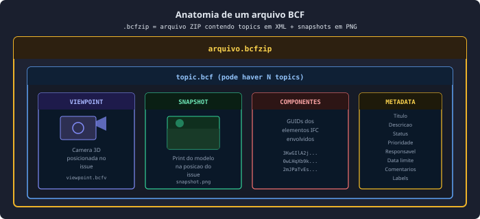
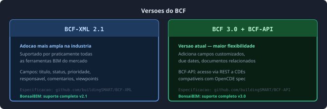
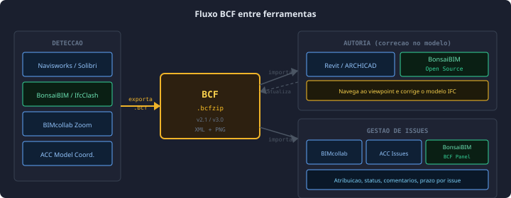
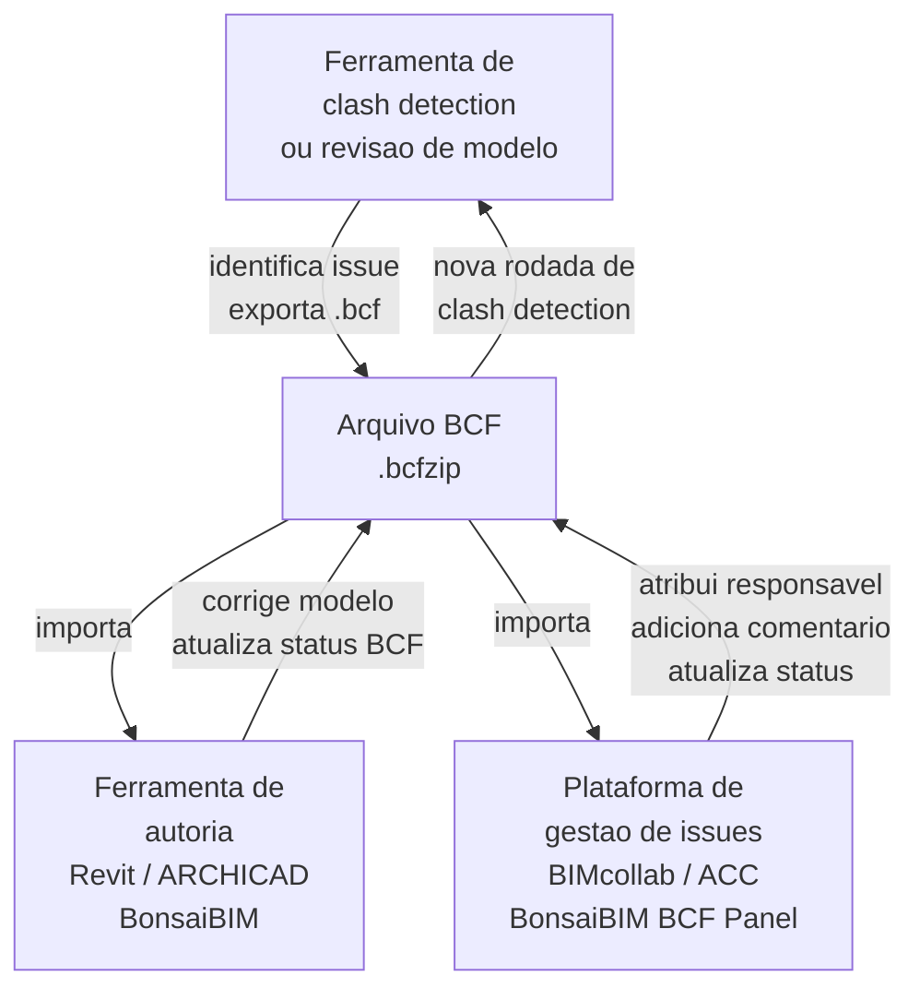

# BCF — BIM Collaboration Format

> **Padrão aberto buildingSMART para comunicação de issues em modelos BIM** — substitui e-mails e prints de tela por um formato estruturado que carrega posição de câmera, snapshot, elementos IFC e metadados de cada problema identificado.

---

## Sumário

1. [O que é o BCF](#o-que-é-o-bcf)
2. [Anatomia de um arquivo BCF](#anatomia-de-um-arquivo-bcf)
3. [Versões do BCF](#versões-do-bcf)
4. [Fluxo de uso](#fluxo-de-uso)
5. [Status de um topic BCF](#status-de-um-topic-bcf)
6. [Ferramentas](#ferramentas)
7. [BCF no contexto do clash detection](#bcf-no-contexto-do-clash-detection)
8. [Boas práticas](#boas-práticas)
9. [Referências](#referências)

---

## O que é o BCF

O **BCF (BIM Collaboration Format)** é um padrão aberto desenvolvido pela **buildingSMART International** para gerenciar e trocar *topics* de coordenação entre disciplinas que colaboram em um projeto BIM.[^1]

Um *topic* BCF é essencialmente um **issue estruturado**: um problema identificado no modelo (clash, inconsistência, dúvida de projeto, solicitação de mudança) que pode ser comunicado entre equipes de forma rastreável, independente do software utilizado.

!!! tip "BCF vs e-mail"
    O BCF elimina o ciclo de e-mails com prints de tela. Cada issue carrega a **posição exata da câmera** no modelo — o destinatário clica e navega diretamente ao problema, sem precisar localizar manualmente. Comentários, status, responsável e prazo ficam todos no mesmo arquivo.[^1]

!!! note "Relação com IFC"
    O BCF **não transporta geometria** — ele referencia elementos IFC pelos seus GUIDs. O modelo IFC permanece no CDE; o BCF carrega apenas as coordenadas do viewpoint, o snapshot e os identificadores dos elementos envolvidos. Isso mantém os arquivos BCF pequenos e interoperáveis.[^2]

---

## Anatomia de um arquivo BCF

Um arquivo BCF (`.bcf` ou `.bcfzip`) é um pacote ZIP contendo um ou mais *topics* em XML, acompanhados de snapshots PNG.[^1]

### Componentes de um topic

| Componente | Arquivo | Conteúdo |
|-----------|---------|---------|
| **Viewpoint** | `viewpoint.bcfv` | Posição e direção da câmera 3D, visibilidade de elementos, seções de corte ativas |
| **Snapshot** | `snapshot.png` | Captura da tela no momento da criação do issue — referência visual rápida |
| **Componentes** | `markup.bcf` | Lista de GUIDs dos elementos IFC envolvidos no issue |
| **Metadata** | `markup.bcf` | Título, descrição, status, prioridade, responsável, prazo, comentários, labels |

---

## Versões do BCF

### BCF-XML vs BCF-API

O padrão BCF existe em dois modos de operação:[^3]

**BCF-XML** — troca de arquivos `.bcfzip` entre ferramentas. Adequado para workflows offline, migrações entre CDEs ou implementações sem servidor central. É o formato suportado por praticamente todas as ferramentas BIM.

**BCF-API** — API RESTful para gestão de topics em tempo real, definida pela especificação **OpenCDE** da buildingSMART. Quando uma CDE implementa a BCF-API, as ferramentas de autoria podem criar, ler e atualizar issues diretamente no servidor sem exportar arquivos.

| Aspecto | BCF-XML | BCF-API |
|---------|---------|---------|
| **Modo** | Arquivo (.bcfzip) | REST (HTTP) |
| **Uso típico** | Troca pontual entre ferramentas | Integração contínua com CDE |
| **Versão atual** | 2.1 e 3.0 | 3.0 |
| **Offline** | Sim | Não |
| **Suporte BonsaiBIM** | Completo (2.1 e 3.0) | BCF-API 3.0 via `ifcopenshell.bcf`[^4] |

---

## Fluxo de uso

### Ciclo típico de coordenação com BCF

1. **Detectar** — ferramenta de clash detection identifica o problema e cria um topic BCF com viewpoint e snapshot
2. **Exportar** — arquivo `.bcfzip` é publicado no CDE ou enviado à equipe responsável
3. **Revisar** — equipe abre o BCF no software de autoria, navega ao viewpoint e entende o problema
4. **Resolver** — modelo é corrigido; status do topic atualizado para *Reviewed* ou *Resolved*
5. **Validar** — nova rodada de clash detection confirma que o issue foi resolvido
6. **Fechar** — topic marcado como *Closed* no sistema de rastreamento

---

## Status de um topic BCF

O BCF define um conjunto de status padronizados para o ciclo de vida de cada topic:[^1]

| Status | Significado | Quem define |
|--------|------------|------------|
| **Open** | Issue identificado, aguardando ação | Criador do topic |
| **In Progress** | Equipe responsável está trabalhando na solução | Disciplina responsável |
| **Resolved** | Solução implementada no modelo | Disciplina responsável |
| **Closed** | Verificado e confirmado pelo coordenador | BIM Coordinator / BIM Manager |
| **Reopened** | Solução foi insuficiente — issue reaberto | BIM Manager |

!!! note "Customização de status"
    O BCF 3.0 permite definir status customizados no projeto além dos padrão. Ferramentas como BIMcollab permitem mapear fluxos de aprovação específicos (ex: *Pending Client Approval*) mantendo compatibilidade com o schema BCF.[^3]

---

## Ferramentas

### Criação e exportação de BCF

| Ferramenta | Fabricante | Tipo | Capacidades BCF |
|-----------|-----------|------|----------------|
| **Navisworks Manage** | Autodesk | Desktop · Comercial | Exporta clashes como topics BCF com viewpoint e snapshot automáticos[^5] |
| **Solibri** | Nemetschek | Desktop · Comercial | Exportação BCF com regras de classificação e severidade[^6] |
| **BIMcollab Zoom** | BIMcollab | Desktop · Freemium | Criação manual de topics BCF com anotações 3D[^7] |
| **Revit / ARCHICAD** | Autodesk / Graphisoft | Desktop · Comercial | Criação de topics BCF dentro do ambiente de autoria |
| **BonsaiBIM** | IfcOpenShell | Desktop · Open Source | Criação, edição e exportação BCF-XML 2.1 e 3.0 dentro do Blender[^4] |

> **BonsaiBIM na prática:** O módulo BCF do BonsaiBIM (acessado via painel *BIM > Coordination > BCF*) permite carregar um arquivo `.bcf`, navegar entre topics com um clique — que reposiciona automaticamente a câmera do Blender no viewpoint do issue — adicionar comentários, alterar status e salvar o arquivo atualizado. Por ser baseado na biblioteca `bcf` do IfcOpenShell, suporta tanto BCF-XML 2.1 quanto 3.0. Isso torna o BonsaiBIM a única ferramenta **totalmente gratuita e open-source** que integra autoria IFC nativa com gestão completa de BCF em um único ambiente — ideal para o fluxo prático do curso, onde todas as etapas (modelagem, clash detection, BCF) ocorrem sem sair do Blender.[^4]

### Gestão de issues e plataformas CDE

| Ferramenta | Tipo | Capacidades BCF |
|-----------|------|----------------|
| **BIMcollab NEXUS** | SaaS · Comercial | Plataforma BCF nativa — BCF-API 3.0, dashboard por disciplina, integra com todos os authoring tools[^7] |
| **Autodesk Construction Cloud** | SaaS · Comercial | Issues integrados ao modelo, exportação BCF, workflows de aprovação[^5] |
| **BIM Track** | SaaS · Comercial | Dashboard visual de issues, BCF-API, notificações por responsável |
| **Revizto** | SaaS · Comercial | Visual issue tracking 3D, BCF import/export, integração Revit |
| **IfcOpenShell BCF library** | Python · Open Source | API programática completa para criar, ler e modificar BCF-XML e BCF-API[^4] |

> **BonsaiBIM na prática:** Para gestão programática de BCF em projetos que exigem automação, a biblioteca `ifcopenshell.bcf` permite escrever scripts Python para processar lotes de arquivos BCF — por exemplo, extraindo todos os topics com status *Open* de uma pasta de modelos e gerando um relatório CSV. No curso, exploraremos tanto o uso gráfico do painel BCF no BonsaiBIM quanto scripts simples com `ifcopenshell.bcf` para automação de relatórios de coordenação.

---

## BCF no contexto do clash detection

O BCF é o **meio de comunicação** dos resultados de clash detection. Quando uma ferramenta identifica um clash, ela cria um topic BCF contendo:

- o viewpoint posicionado no clash
- o snapshot mostrando os dois elementos em conflito
- os GUIDs dos elementos IFC colidentes (permitindo rastrear qual objeto de qual modelo está envolvido)
- metadados como disciplina responsável pela correção, prioridade e prazo

Sem BCF, os resultados ficam presos dentro da ferramenta de clash detection. Com BCF, eles fluem para qualquer ferramenta da cadeia — authoring, CDE, gestão de obras — de forma padronizada e rastreável.[^8]

!!! note "Consulte também"
    Para o processo completo de clash detection — tipos de clash, clash matrix, fluxo de trabalho e ferramentas de detecção — consulte o material [**Clash Detection em BIM**](../clash/clash-detection-material.md).

---

## Boas práticas

- **Um topic por causa raiz, não por elemento:** se 12 vigas colidem com o mesmo ducto pela mesma razão de projeto, crie um único topic — não 12. Isso mantém o registro gerenciável.[^9]
- **Preencher responsável e prazo sempre:** topics sem dono e sem data não são resolvidos. O BCF deve incluir a disciplina responsável pela correção e uma data-limite realista.[^9]
- **Usar labels para filtrar:** labels como `estrutura`, `AVAC`, `prioridade-alta` permitem filtrar e priorizar issues em reuniões de coordenação sem percorrer toda a lista.
- **Não fechar sem re-verificar no modelo:** o status *Closed* só deve ser aplicado após confirmar que o modelo corrigido passou no novo ciclo de clash detection.[^8]
- **Versionar o BCF com o modelo:** o arquivo BCF deve ser versionado junto com o modelo IFC correspondente no CDE — um BCF de uma versão antiga do modelo pode ter viewpoints inválidos na versão atual.
- **Usar BCF-API quando disponível:** para projetos com muitas disciplinas e alto volume de issues, uma CDE com BCF-API elimina a troca manual de arquivos — os updates de status são sincronizados em tempo real entre todas as ferramentas.[^3]

---

## Referências

[^1]: buildingSMART International. *BCF — BIM Collaboration Format*. Repositório oficial BCF-XML. Disponível em: <https://github.com/buildingSMART/BCF-XML>. Acesso em: abr. 2026.

[^2]: buildingSMART International. *Clash Detection — Use Case Management*. Disponível em: <https://ucm.buildingsmart.org/en/use-cases/2834/en>. Acesso em: abr. 2026.

[^3]: buildingSMART International. *BCF-API 3.0 — OpenCDE Specification*. Disponível em: <https://github.com/buildingSMART/BCF-API>. Acesso em: abr. 2026.

[^4]: IfcOpenShell. *BCF — IfcOpenShell 0.8.x documentation*. Disponível em: <https://docs.ifcopenshell.org/bcf.html>. Acesso em: abr. 2026.

[^5]: Autodesk. *Navisworks Manage — Clash Detection and BCF Export*. Disponível em: <https://www.autodesk.com/products/navisworks/features>. Acesso em: abr. 2026.

[^6]: Solibri. *Solibri — Smart BIM Model Checking*. Disponível em: <https://www.solibri.com>. Acesso em: abr. 2026.

[^7]: BIMcollab. *BIMcollab NEXUS — BCF Issue Management Platform*. Disponível em: <https://www.bimcollab.com>. Acesso em: abr. 2026.

[^8]: BIM Corner. *Clash Detection 101: Preventing Construction Conflicts with BIM*. Disponível em: <https://bimcorner.com/clash-detection-101-preventing-construction-conflicts-with-bim/>. Acesso em: abr. 2026.

[^9]: BIM Heroes. *Clash Detection in BIM: From Software Feature to Production Governance*. Disponível em: <https://bimheroes.com/clash-detection-bim/>. Acesso em: abr. 2026.
