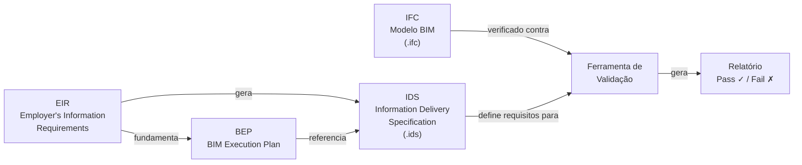
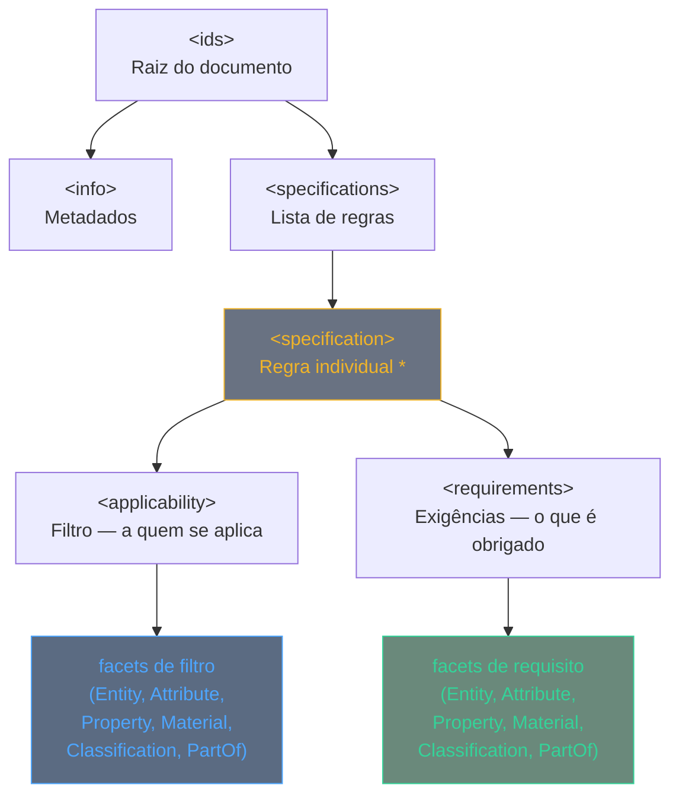
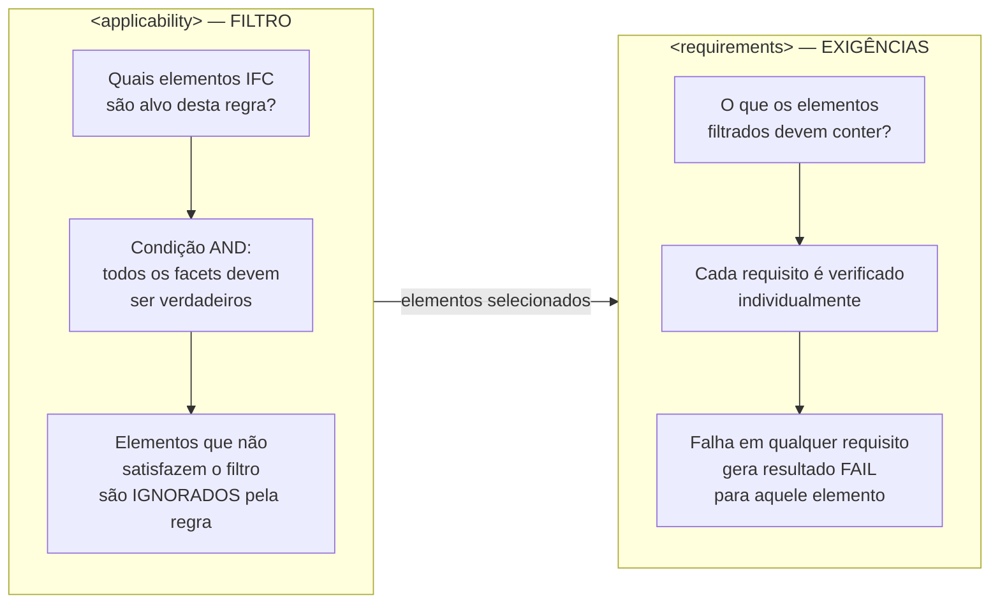
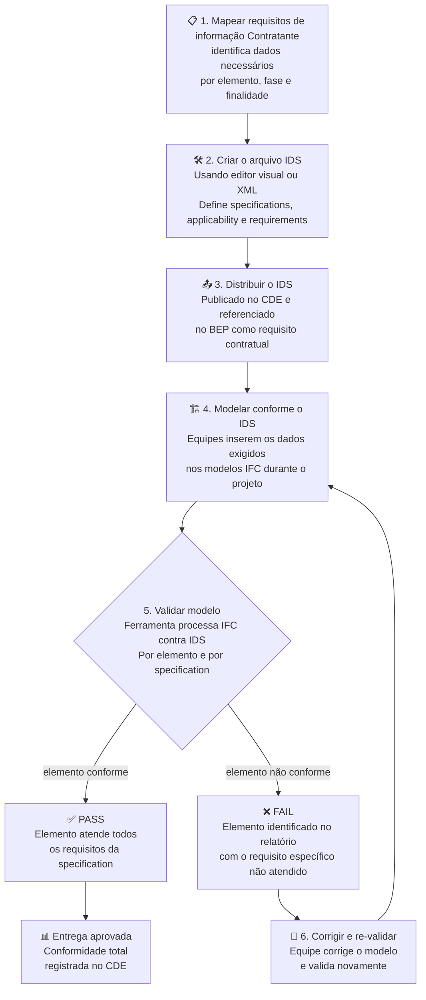

# Information Delivery Specification (IDS)

> **Padrão aberto buildingSMART** — define, de forma legível por máquina, quais informações são obrigatórias em um modelo IFC, tornando os requisitos do EIR verificáveis automaticamente.

---

## Sumário

1. [O que é o IDS](#o-que-é-o-ids)
2. [Relação com o IFC e o BEP](#relação-com-o-ifc-e-o-bep)
3. [Estrutura do arquivo IDS](#estrutura-do-arquivo-ids)
4. [Facets — os tipos de requisito](#facets--os-tipos-de-requisito)
5. [Applicability vs Requirements](#applicability-vs-requirements)
6. [Exemplos práticos](#exemplos-práticos)
7. [Fluxo de uso do IDS](#fluxo-de-uso-do-ids)
8. [Ferramentas do ecossistema](#ferramentas-do-ecossistema)
9. [Glossário](#glossário)
10. [Referências](#referências)

---

## O que é o IDS

O **IDS (Information Delivery Specification)** é um padrão aberto desenvolvido pela **buildingSMART International** que define, de forma **legível por máquina**, quais informações são necessárias em um modelo BIM.[^1]

O IDS especifica entidades IFC, atributos, propriedades, materiais, classificações e relacionamentos que os elementos do modelo **devem conter** — permitindo a verificação automática de conformidade por ferramentas de validação.

| Atributo | Valor |
|----------|-------|
| **Desenvolvido por** | buildingSMART International |
| **Formato de arquivo** | XML com extensão `.ids` |
| **Schema de validação** | XSD público no GitHub buildingSMART |
| **Versão atual** | IDS 1.0 |
| **Norma relacionada** | ISO 21597 (IDM) |
| **Repositório oficial** | github.com/buildingSMART/IDS |

!!! note "Padrão aberto"
    O schema XSD e a documentação do IDS são publicados gratuitamente no GitHub da buildingSMART. A implementação é livre em qualquer software ou workflow, sem licenciamento.[^1]

---

## Relação com o IFC e o BEP

O IDS não substitui o IFC — é **complementar** a ele. Enquanto o IFC é o formato de dados do modelo, o IDS especifica os requisitos que esse modelo deve atender.[^2]



### IDS vs MVD

| Característica | MVD | IDS |
|----------------|-----|-----|
| **O que define** | Subconjunto do schema IFC para um uso | Requisitos específicos de um projeto/fase |
| **Pergunta que responde** | *O que pode existir no IFC?* | *O que deve existir no modelo?* |
| **Escopo** | Intercâmbio entre sistemas | Conformidade de entregáveis |
| **Formato** | XML (mvdXML) | XML (.ids) |
| **Público-alvo** | Desenvolvedores de software | Profissionais de projeto e gestão BIM |
| **Relação** | Complementares — não se excluem | Complementares — não se excluem |

---

## Estrutura do arquivo IDS

Um arquivo `.ids` é um documento XML com estrutura hierárquica bem definida.[^3]


<!-- #f0b429
#697282

#5b6b82

#6a897b -->
> **\*** Um arquivo IDS pode conter **N specifications** independentes, cada uma com seu próprio escopo e conjunto de requisitos.

### Elementos da estrutura

#### `<ids>` — Raiz

Elemento raiz do documento. Contém o namespace buildingSMART e agrupa todas as especificações do projeto ou contrato.

#### `<info>` — Metadados

Informações sobre o próprio arquivo IDS: título, versão, autor, data e descrição. Não afeta a lógica de validação, mas é essencial para rastreabilidade e gestão documental.

#### `<specification>` — Unidade fundamental

A unidade central do IDS. Cada specification é uma **regra independente** que combina:

- **`<applicability>`** — define *quais elementos IFC* são alvo da verificação (filtro)
- **`<requirements>`** — define *o que esses elementos devem conter* para passar na validação

#### Exemplo de arquivo IDS comentado

```xml
<!-- Arquivo IDS mínimo — um requisito de exemplo -->
<ids xmlns="http://standards.buildingsmart.org/IDS">

  <info>
    <title>Requisitos BIM — Projeto Executivo</title>
    <version>1.0</version>
    <author>equipe.bim@construtora.com.br</author>
    <date>2025-06-01</date>
  </info>

  <specifications>

    <specification
      name="Paredes devem ter resistência ao fogo"
      ifcVersion="IFC4">

      <!-- A QUEM SE APLICA? (filtro) -->
      <applicability>
        <entity>
          <name><simpleValue>IfcWall</simpleValue></name>
        </entity>
      </applicability>

      <!-- O QUE É EXIGIDO? (requisito) -->
      <requirements>
        <property dataType="IFCLABEL">
          <propertySet>
            <simpleValue>Pset_WallCommon</simpleValue>
          </propertySet>
          <baseName>
            <simpleValue>FireRating</simpleValue>
          </baseName>
        </property>
      </requirements>

    </specification>

  </specifications>
</ids>
```

---

## Applicability vs Requirements

Em uma `specification` IDS, **`<applicability>`** e **`<requirements>`** cumprem papéis diferentes e complementares. O primeiro define **a quais elementos IFC a regra se aplica**; o segundo define **quais regras os elementos selecionados devem seguir

** para serem considerados conformes.

Em termos práticos, `applicability` funciona como um **filtro de seleção**, enquanto `requirements` funciona como um **conjunto de verificações** executadas somente sobre os elementos filtrados. Assim, um elemento fora do filtro não falha na regra; ele simplesmente não é avaliado por ela.



---

## Facets — os tipos de requisito

Facets são os **blocos de construção** do IDS.[^3] Cada facet representa um aspecto diferente de um elemento IFC que pode ser usado tanto em `<applicability>` (para filtrar) quanto em `<requirements>` (para exigir).

O IDS 1.0 define **6 facets**:

### Tabela de facets

| Facet | Parâmetros `<applicability>` | Parâmetros `<requirements>` | Uso típico |
|-------|------------------------------|----------------------------|-----------|
| **Entity** | `name`, `predefinedType` | `name`, `predefinedType`, `instructions` | Selecionar `IfcWall` com `predefinedType = SOLIDWALL` |
| **Attribute** | `name`, `value` | `name`, `value`, `cardinality`, `instructions` | Exigir que `Name` não seja vazio; verificar `Description` |
| **Property** | `propertySet`, `baseName`, `value`, `dataType` | `propertySet`, `baseName`, `value`, `dataType`, `uri`, `cardinality`, `instructions` | Exigir `IsExternal = TRUE` em `Pset_WallCommon` |
| **Material** | `value` | `value`, `uri`, `cardinality`, `instructions` | Exigir material `Concreto` em pilares |
| **Classification** | `system`, `value` | `system`, `value`, `uri`, `cardinality`, `instructions` | Exigir código Uniclass 2015 em todas as portas |
| **PartOf** | `entity.name`, `entity.predefinedType`, `relation` | `entity.name`, `entity.predefinedType`, `relation`, `cardinality`, `instructions` | Exigir que janelas pertençam a um `IfcBuildingStorey` |

### Restrições de valor

Cada facet pode usar diferentes formas de restrição para o valor esperado:

| Restrição | Sintaxe XML | Exemplo |
|-----------|-------------|---------|
| Valor exato | `<simpleValue>` | `FireRating` deve ser exatamente `"EI60"` |
| Lista de valores | `<xs:enumeration>` | Aceitar `"EI30"`, `"EI60"` ou `"EI90"` |
| Padrão regex | `<xs:pattern>` | Código Uniclass que comece com `"Pr_25"` |
| Intervalo numérico | `<xs:minInclusive>` / `<xs:maxInclusive>` | Espessura entre `150` e `300` mm |
| Comprimento | `<xs:length>` | Nome com exatamente 10 caracteres |

---


### Atributo `cardinality`

O elemento `<requirements>` suporta o atributo `cardinality` para definir a natureza de cada requisito:

| Valor | Comportamento |
|-------|--------------|
| `required` *(padrão)* | O elemento **deve** ter este dado preenchido — ausência gera FAIL |
| `optional` | O elemento **pode** ter este dado — se presente, o valor é verificado |
| `prohibited` | O elemento **não deve** ter este dado — presença gera FAIL |

---

## Exemplos práticos

### Exemplo 1 — Espaços com programa de necessidades

Todo `IfcSpace` deve ter nome longo e área bruta preenchidos.[^4]

```xml
<specification name="Espaços com uso definido" ifcVersion="IFC4">

  <applicability>
    <entity>
      <name><simpleValue>IfcSpace</simpleValue></name>
    </entity>
  </applicability>

  <requirements>

    <!-- Exige nome do espaço (LongName) -->
    <attribute>
      <name><simpleValue>LongName</simpleValue></name>
    </attribute>

    <!-- Exige área bruta no Quantity Set -->
    <property dataType="IFCAREAMEASURE">
      <propertySet>
        <simpleValue>Qto_SpaceBaseQuantities</simpleValue>
      </propertySet>
      <baseName>
        <simpleValue>GrossFloorArea</simpleValue>
      </baseName>
    </property>

  </requirements>
</specification>
```

---

### Exemplo 2 — Portas com código de classificação Uniclass 2015

Toda `IfcDoor` deve ter um código Uniclass 2015 iniciado em `Pr_25` (padrão regex).[^4]

```xml
<specification name="Classificação obrigatória em portas" ifcVersion="IFC4">

  <applicability>
    <entity>
      <name><simpleValue>IfcDoor</simpleValue></name>
    </entity>
  </applicability>

  <requirements>
    <classification>
      <system>
        <simpleValue>Uniclass2015</simpleValue>
      </system>
      <!-- Aceita qualquer código que comece com Pr_25 -->
      <value>
        <xs:restriction base="xs:string">
          <xs:pattern value="Pr_25.*"/>
        </xs:restriction>
      </value>
    </classification>
  </requirements>

</specification>
```

---

### Exemplo 3 — Vigas de concreto com resistência ao fogo por enumeração

`IfcBeam` com material `Concreto` deve ter `FireRating` igual a `EI30`, `EI60` ou `EI90`.[^4]

```xml
<specification name="FireRating em vigas estruturais de concreto">

  <!-- FILTRO: apenas vigas de concreto -->
  <applicability>
    <entity>
      <name><simpleValue>IfcBeam</simpleValue></name>
    </entity>
    <material>
      <value><simpleValue>Concreto</simpleValue></value>
    </material>
  </applicability>

  <!-- REQUISITO: FireRating com valor controlado -->
  <requirements>
    <property dataType="IFCLABEL">
      <propertySet>
        <simpleValue>Pset_BeamCommon</simpleValue>
      </propertySet>
      <baseName>
        <simpleValue>FireRating</simpleValue>
      </baseName>
      <!-- Lista de valores aceitos -->
      <value>
        <xs:restriction base="xs:string">
          <xs:enumeration value="EI30"/>
          <xs:enumeration value="EI60"/>
          <xs:enumeration value="EI90"/>
        </xs:restriction>
      </value>
    </property>
  </requirements>

</specification>
```

---

## Fluxo de uso do IDS



### Quando usar o IDS no ciclo de vida BIM

| Fase | IDS típico | Finalidade |
|------|-----------|-----------|
| **Licitação / Contrato** | IDS do EIR | Contratado valida capacidade de entrega antes da assinatura |
| **Estudo Preliminar (LP)** | IDS de LP | Garante dados mínimos (nome, área, uso) em espaços e volumes |
| **Anteprojeto (AP)** | IDS de AP | Verificar propriedades de desempenho, materiais e classificações |
| **Projeto Executivo (EP)** | IDS de EP | Verificação completa de Psets, LOD 350, quantitativos |
| **Obras** | IDS de campo | Dados as-built: fabricante, número de série, data de instalação |
| **Operação (FM/AM)** | IDS de FM | COBie compliance, sistemas de manutenção, dados de energia |

---

## Ferramentas do ecossistema

### Criação e edição de arquivos IDS

| Ferramenta | Tipo | Descrição |
|-----------|------|-----------|
| **IDS Editor (buildingSMART)** | Web · Open Source | Editor visual oficial. Interface gráfica para criar `.ids` sem editar XML manualmente.[^5] |
| **BIMcollab NEXUS** | SaaS · Comercial | Plataforma CDE com suporte nativo a IDS para gestão de requisitos integrada ao fluxo de revisão.[^6] |
| **VS Code + extensão XML** | IDE · Open Source | Edição manual com autocomplete via schema XSD. Adequado para automação em pipelines CI/CD.[^7] |

### Validação de modelos IFC contra IDS

| Ferramenta | Tipo | Descrição |
|-----------|------|-----------|
| **IfcOpenShell (Python)** | Biblioteca · Open Source | Módulo `ifcopenshell.ids` para validação programática. Integra com scripts Python e plataformas de dados BIM.[^8] |
| **Solibri** | Desktop · Comercial | Suporte nativo a IDS com relatórios visuais e exportação BCF para comunicação de falhas.[^6] |
| **BIMcollab ZOOM** | Desktop · Freemium | Viewer gratuito com validação IDS. Exporta relatórios e BCF para gestão de issues.[^6] |
| **ARCHICAD 27+** | BIM Authoring · Comercial | Validação de IDS dentro do software de autoria. Projetistas verificam sem sair do ambiente de modelagem.[^9] |

### Recursos e referências oficiais

| Recurso | URL |
|---------|-----|
| Repositório oficial buildingSMART/IDS | <https://github.com/buildingSMART/IDS> |
| Schema XSD do IDS 1.0 | <https://github.com/buildingSMART/IDS/tree/master/Schema> |
| Documentação oficial bSI | <https://standards.buildingsmart.org> |
| IfcOpenShell — docs IDS | <https://ifcopenshell.org/docs> |
| Editor visual IDS (web) | <https://ids.buildingsmart.org> |

---

## Glossário

| Termo | Definição |
|-------|-----------|
| **IDS** | Information Delivery Specification. Padrão XML da buildingSMART para definir requisitos de informação verificáveis automaticamente em modelos IFC. |
| **IFC** | Industry Foundation Classes. Formato neutro e aberto para intercâmbio de dados BIM, padronizado como ISO 16739. O IDS opera sobre modelos IFC. |
| **Facet** | Bloco de construção do IDS. Os 6 facets são: Entity, Attribute, Property, Material, Classification e PartOf. Usados em `applicability` e `requirements`. |
| **Specification** | Unidade de regra do IDS. Contém `applicability` (filtro) e `requirements` (exigências). Um arquivo IDS pode ter múltiplas specifications. |
| **Applicability** | Parte da specification que define quais elementos IFC são alvo da verificação, usando um ou mais facets como filtro (condição AND lógico). |
| **Requirements** | Parte da specification que define o que os elementos filtrados devem conter para passar na validação. Cada requisito é verificado individualmente. |
| **Pset** | Property Set. Conjunto de propriedades agrupadas por tema em modelos IFC. Ex: `Pset_WallCommon`, `Pset_BeamCommon`. Referenciados no facet Property. |
| **Qset** | Quantity Set. Similar ao Pset, para quantidades físicas mensuráveis (área, volume, comprimento). Ex: `Qto_WallBaseQuantities`. |
| **EIR** | Employer's Information Requirements. Documento do contratante que define os requisitos de informação. O IDS é a expressão legível por máquina do EIR. |
| **MVD** | Model View Definition. Subconjunto do schema IFC para um caso de uso. Complementar ao IDS: MVD define o que *pode existir*; IDS, o que *deve existir*. |
| **cardinality** | Atributo de `requirements` no IDS que define se o requisito é obrigatório (`required`), opcional (`optional`) ou proibido (`prohibited`). |
| **predefinedType** | Atributo de entidades IFC que especializa o tipo. Ex: `IfcWall` com `predefinedType = SOLIDWALL`; `IfcBeam` com `predefinedType = JOIST`. |
| **BCF** | BIM Collaboration Format. Formato para comunicação de issues em modelos BIM. Ferramentas de validação IDS exportam falhas em BCF. |
| **Open BIM** | Abordagem colaborativa baseada em padrões abertos (IFC, IDS, BCF) que garante interoperabilidade independente do software utilizado. |
| **buildingSMART** | Organização internacional responsável pelos padrões Open BIM: IFC, IDS, BCF, bSDD (buildingSMART Data Dictionary). |

---

## Referências

[^1]: buildingSMART International. *IDS — Information Delivery Specification — Standard 1.0*. Repositório oficial. Disponível em: <https://github.com/buildingSMART/IDS>. Acesso em: abr. 2026.

[^2]: buildingSMART International. *IDS vs MVD — Complementary standards*. Disponível em: <https://standards.buildingsmart.org>. Acesso em: abr. 2026.

[^3]: buildingSMART International. *IDS Schema Documentation — XSD Reference*. Disponível em: <https://github.com/buildingSMART/IDS/tree/master/Schema>. Acesso em: abr. 2026.

[^4]: buildingSMART International. *IDS Example Files*. Exemplos oficiais de specifications. Disponível em: <https://github.com/buildingSMART/IDS/tree/master/Documentation/examples>. Acesso em: abr. 2026.

[^5]: buildingSMART International. *IDS Editor — ferramenta visual oficial*. Disponível em: <https://ids.buildingsmart.org>. Acesso em: abr. 2026.

[^6]: BIMcollab. *BIMcollab NEXUS e ZOOM — suporte a IDS*. Disponível em: <https://www.bimcollab.com>. Acesso em: abr. 2026.

[^7]: IfcOpenShell. *IfcOpenShell Python — módulo IDS*. Documentação técnica. Disponível em: <https://ifcopenshell.org/docs>. Acesso em: abr. 2026.

[^8]: IfcOpenShell. *ifcopenshell.ids — validação programática de modelos IFC*. Disponível em: <https://ifcopenshell.org/docs/ids.html>. Acesso em: abr. 2026.

[^9]: GRAPHISOFT. *ARCHICAD 27 — suporte nativo a IDS para validação in-authoring*. Disponível em: <https://graphisoft.com/solutions/archicad>. Acesso em: abr. 2026.
