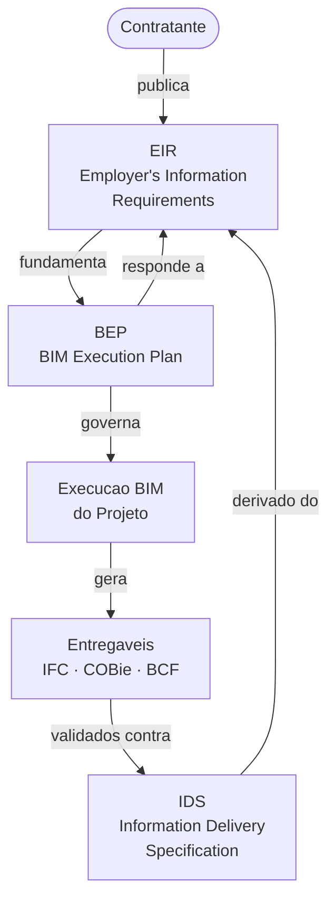
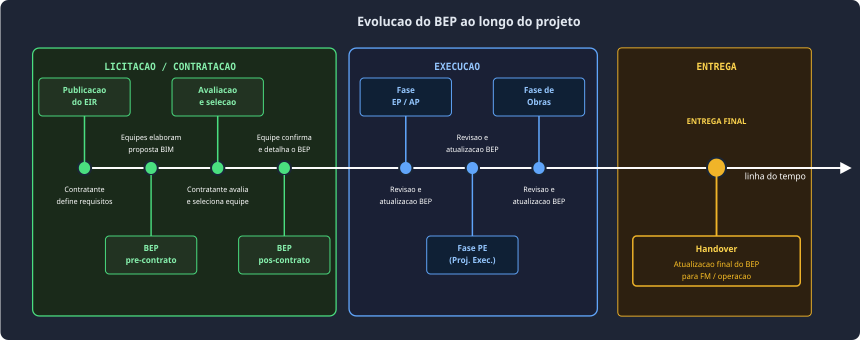
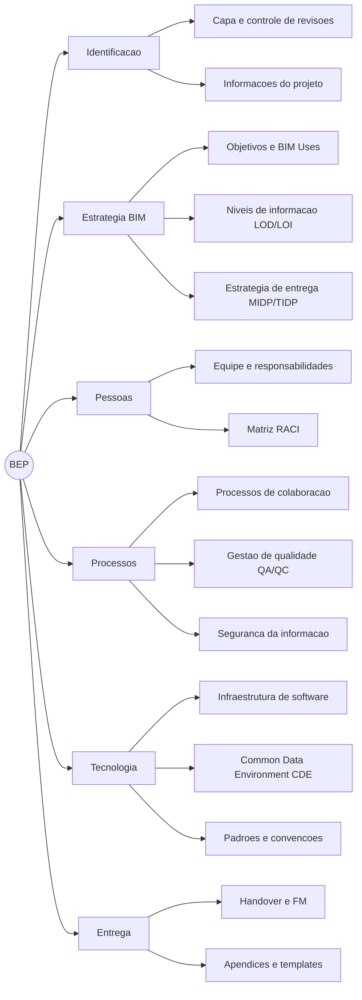
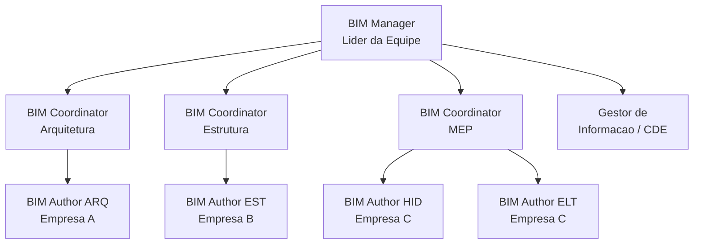
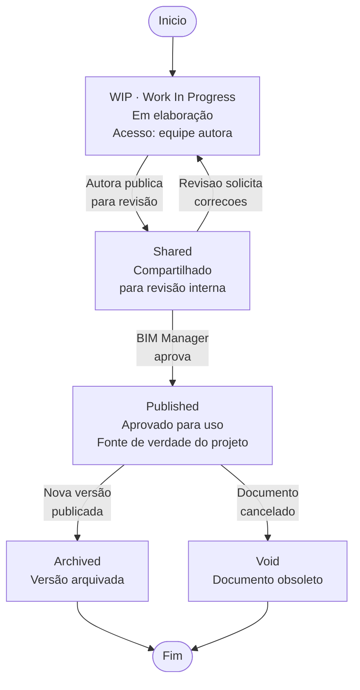
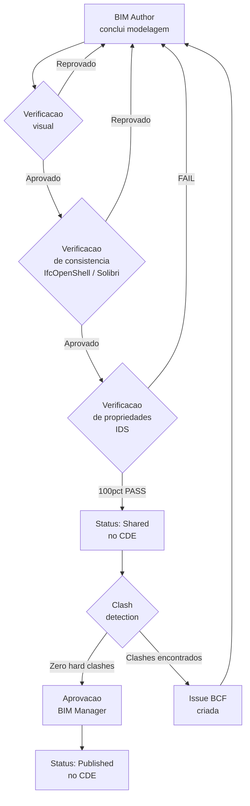
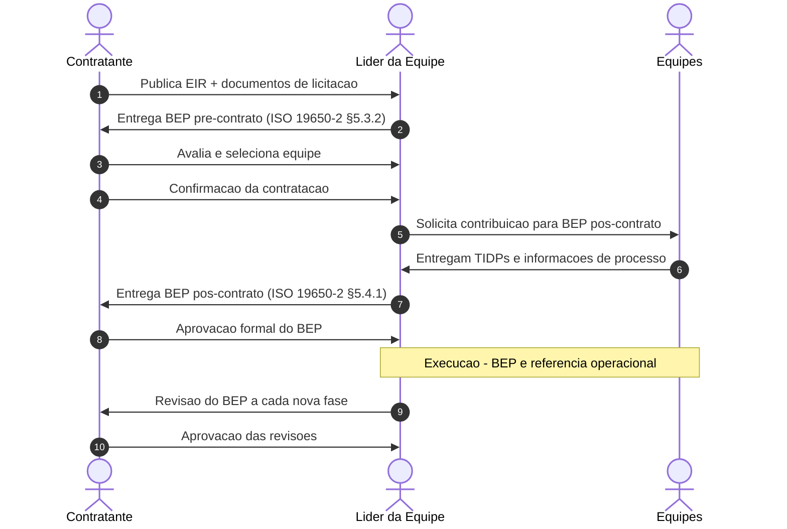
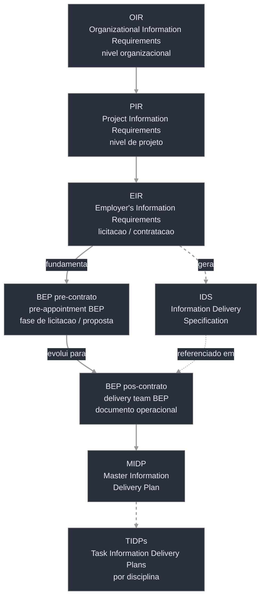
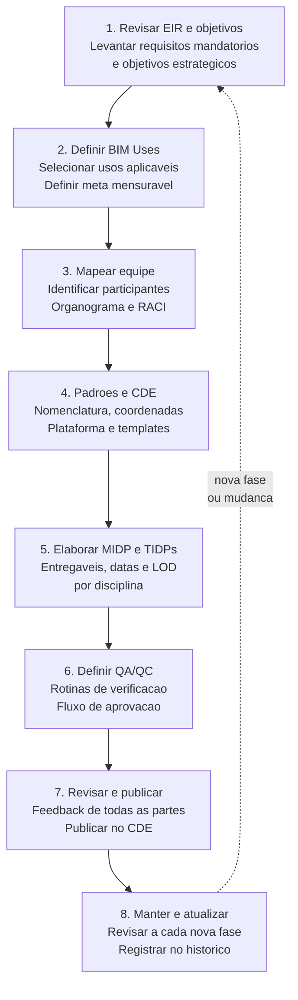

# BIM Execution Plan (BEP)

> **Documento central de governança BIM** — define quem faz o quê, quando, com qual software e em qual nível de detalhe ao longo de todo o ciclo de vida do projeto.

---

## Sumário

1. [O que é o BEP](#o-que-é-o-bep)
2. [Relação com o EIR](#relação-com-o-eir)
3. [Tipos de BEP](#tipos-de-bep)
4. [Seções obrigatórias](#seções-obrigatórias)
5. [Modelo básico de BEP](#modelo-básico-de-bep)
6. [BEP no contexto da ISO 19650](#bep-no-contexto-da-iso-19650)
7. [Fluxo de elaboração](#fluxo-de-elaboração)
8. [Checklist de verificação](#checklist-de-verificação)
9. [Referências](#referências)

---

## O que é o BEP

O **BIM Execution Plan (BEP)**[^bd-bep] é um documento formal que define como os processos BIM serão conduzidos em um projeto específico.[^1] Ele estabelece:

- o **escopo de uso do BIM** (quais BIM Uses serão aplicados);
- os **papéis e responsabilidades** de cada membro da equipe;
- os **procedimentos de colaboração** e protocolos de troca de informação;
- as **especificações de software**, versões e formatos de intercâmbio.

Em síntese, o BEP responde à pergunta: *"Como o BIM será implementado com sucesso neste projeto?"*[^2]

!!! note "Documento vivo"
    O BEP deve ser atualizado ao longo de todo o ciclo de vida do projeto à medida que novas decisões são tomadas, membros entram na equipe ou o escopo evolui. A ISO 19650-2 define momentos específicos de revisão e aprovação.[^3]

!!! tip "Terminologia"
    O BEP também aparece nas siglas **BIM PxP**, **BIM PEP**, **BIMEx** ou **BxP** em diferentes guias. A ISO 19650 adotou oficialmente o termo **BEP**, que tende a se consolidar internacionalmente.[^4]

---

## Relação com o EIR

O BEP é preparado como **resposta ao EIR**[^bd-eir] (Employer's Information Requirements — Requisitos de Informação do Contratante). O contratante define suas expectativas de informação; a equipe de projeto responde descrevendo como entregará essas expectativas.



### Ecossistema de documentos relacionados

Os documentos abaixo formam o contexto informacional em que o BEP está inserido, conforme a hierarquia da **ISO 19650**.[^5]

| Sigla | Nome completo | Definição | Elaborado por |
|-------|--------------|-----------|--------------|
| **OIR**[^bd-oir] | Organizational Information Requirements | Requisitos de informação definidos no nível da organização contratante, estabelecendo as necessidades permanentes de dados para suportar seus processos de negócio e gestão de ativos ao longo do tempo. | Contratante (nível organizacional) |
| **PIR**[^bd-pir] | Project Information Requirements | Requisitos de informação derivados do OIR e específicos para um projeto, definindo quais informações são necessárias para apoiar as decisões ao longo do ciclo de vida daquele empreendimento. | Contratante (nível de projeto) |
| **EIR**[^bd-eir] | Employer's Information Requirements | Requisitos de informação que o contratante comunica às equipes durante a licitação/contratação. É o documento que o BEP deve responder diretamente, detalhando como cada requisito será atendido. | Contratante (para licitação/contratação) |
| **BEP**[^bd-bep] | BIM Execution Plan | Plano que descreve como a equipe de entrega vai gerenciar e produzir a informação do projeto — respondendo ao EIR e detalhando processos, papéis, padrões e tecnologias adotados. | Equipe de entrega (resposta ao EIR) |
| **MIDP**[^bd-midp] | Master Information Delivery Plan | Plano consolidado de entrega de informação de todo o projeto. Lista todos os contêineres de informação a serem produzidos, por quem, em que formato e em que prazo. Integra os TIDPs de cada disciplina. | Líder da equipe de entrega |
| **TIDP**[^bd-tidp] | Task Information Delivery Plan | Plano de entrega de informação para uma tarefa ou disciplina específica. Detalha os contêineres de informação, responsáveis, datas e formatos de uma parte da equipe. Os TIDPs compõem o MIDP. | Cada disciplina / empresa contratada |
| **IDS**[^bd-ids] | Information Delivery Specification | Arquivo XML que define, de forma legível por máquina, os requisitos de informação que os modelos IFC devem atender — permitindo validação automatizada de conformidade contra o EIR. | Contratante ou BIM Manager |

---

## Tipos de BEP

A ISO 19650-2 define duas iterações principais do BEP ao longo do processo de licitação/contratação e execução do projeto.[^5]

> **Siglas de fases do projeto usadas neste documento:** EP = Estudo Preliminar · AP = Anteprojeto · PE = Projeto Executivo



### BEP pré-contrato (*pre-appointment BEP*)

O **BEP pré-contrato** é elaborado pelo potencial líder da equipe de entrega durante o processo de licitação/contratação, como parte integrante da proposta técnica submetida ao contratante.[^6]

Trata-se de um documento **propositivo**: ele descreve a intenção e a capacidade da equipe candidata de atender aos requisitos do EIR[^bd-eir], sem que haja ainda garantia de contratação. Por isso, pode conter aproximações e premissas que serão refinadas caso a equipe seja selecionada.

O BEP pré-contrato tipicamente abrange:

- abordagem geral para a gestão da informação no projeto;
- equipe BIM proposta, com papéis e empresas envolvidas;
- visão geral dos BIM Uses pretendidos e dos objetivos a atingir;
- proposta de plataforma CDE[^bd-cde] e ferramentas de software;
- declaração de competências e experiências anteriores relevantes.

Ao permitir que o contratante avalie a **maturidade BIM** dos concorrentes antes da seleção, o BEP pré-contrato é um instrumento essencial de due diligence técnica. Referenciado na **ISO 19650-2, Cláusula 5.3.2**.[^5]

### BEP pós-contrato (*delivery team BEP*)

O **BEP pós-contrato** é confirmado após a assinatura do contrato, desenvolvido colaborativamente pelo líder da equipe de entrega em conjunto com todas as partes contratadas.[^6]

É o **documento operacional de referência** durante toda a execução do projeto. Ele evolui a partir do BEP pré-contrato, incorporando os feedbacks e exigências do contratante e detalhando todos os aspectos que na fase de proposta eram apenas esboçados.

O BEP pós-contrato deve cobrir integralmente:

- descrição detalhada de todos os BIM Uses com objetivos mensuráveis;
- organograma BIM completo e matriz de responsabilidades (RACI);
- MIDP[^bd-midp] e TIDPs[^bd-tidp] por disciplina, com datas, formatos e níveis de informação;
- padrões e convenções de modelagem, nomenclatura e gestão de arquivos;
- configuração e fluxo de status do CDE[^bd-cde] adotado;
- processos de coordenação, QA/QC e validação contra o IDS[^bd-ids];
- infraestrutura de software e formatos de intercâmbio (IFC, BCF);
- procedimentos de entrega final e handover para FM/operação.

O BEP pós-contrato deve ser **aprovado formalmente pelo contratante** e publicado no CDE antes do início da produção de informação. Referenciado na **ISO 19650-2, Cláusula 5.4.1**.[^5]

---

## Seções obrigatórias

Com base na ISO 19650, Penn State BEP Guide e NBIMS-US, as seções essenciais de um BEP completo são:[^7][^8][^9]



A NATSPEC estrutura as seções do BEP em três aspectos conforme a **ISO 19650.1, Seção 5**:[^10]

- **Comercial** — entrega, contrato, equipe, finalidades da informação
- **Gerencial** — QA, segurança, gestão do CDE, revisões
- **Técnico** — padrões, software, formatos, convenções

---

## Modelo básico de BEP

A seguir, o conteúdo esperado em cada seção de um BEP típico para projeto de edificação.

---

### 1.0 Capa e Controle de Revisões

Identifica o documento e registra seu histórico.

| Campo | Valor |
|-------|-------|
| Título | BIM Execution Plan — [Nome do Projeto] |
| Número | [PROJ-BEP-001] |
| Status | Rascunho / Compartilhado / Publicado |
| Versão | [1.0] |

**Histórico de revisões:**

| Rev. | Data | Descrição | Elaborado por | Aprovado por |
|------|------|-----------|---------------|--------------|
| P0 | dd/mm/aaaa | Emissão inicial | [Nome] | [Nome] |
| P1 | dd/mm/aaaa | Incorpora feedback do EIR | [Nome] | [Nome] |
| C0 | dd/mm/aaaa | Versão contratual | [Nome] | [Nome] |

---

### 2.0 Informações do Projeto

| Campo | Conteúdo |
|-------|----------|
| Nome do projeto | [Nome oficial] |
| Localização | [Endereço completo] |
| Cliente / Contratante | [Razão social + CNPJ] |
| Fases cobertas |  EP / AP (Anteprojeto) / PE (Projeto Executivo) / Obras / Operação |
| Disciplinas | [ARQ / EST / HID / ELT / AR-COND / ...] |
| Versão IFC adotada | [IFC 4 / IFC 4.3] |
| Norma de referência | ISO 19650-2:2018 / ABNT NBR ISO 19650 |

---

### 3.0 Objetivos e Usos do BIM

Lista os BIM Uses definidos para o projeto, com objetivos mensuráveis para cada um.[^1]

| # | BIM Use | Fase | Objetivo mensurável | Responsável |
|---|---------|------|---------------------|-------------|
| 01 | Modelagem de projeto | EP → PE | Modelo único de referência por disciplina | BIM Author |
| 02 | Coordenação 3D / Clash detection | AP → PE | Zero clashes hard antes do início da obra | BIM Coordinator |
| 03 | Quantitativos e orçamento | PE | Extração automática com desvio ≤ 5% | Orçamentista |
| 04 | Planejamento 4D | Obras | Sequenciamento vinculado ao cronograma Ms Project | Const. BIM |
| 05 | Análise de sustentabilidade | AP | Simulação energética para LEED/AQUA | Consultor |
| 06 | Gestão de ativos (FM) | Entrega | Modelo COBie para CMMS do cliente | FM Manager |

---

### 4.0 Equipe e Responsabilidades



**Matriz de responsabilidades (RACI):**

| Atividade | BIM Manager | BIM Coord. | BIM Author | Gestor Info. | Contratante |
|-----------|:-----------:|:----------:|:----------:|:------------:|:-----------:|
| Elaborar e aprovar BEP | A | C | I | C | A |
| Modelar por disciplina | I | R | R | I | I |
| Clash detection | A | R | C | I | I |
| Publicar no CDE | A | C | C | R | I |
| Verificação QA/QC | A | R | R | C | I |
| Aprovação de entregas | C | C | I | I | A |

> **Legenda:** R = Responsável · A = Aprovador · C = Consultado · I = Informado

---

### 5.0 Estratégia de Entrega de Informação

O **MIDP**[^bd-midp] (Master Information Delivery Plan) consolida todos os entregáveis de informação do projeto. Cada disciplina elabora seu **TIDP**[^bd-tidp] (Task Information Delivery Plan).[^8]

| Disciplina | Marco de entrega | Data prevista | Formato nativo | Intercâmbio | LOD | Responsável |
|------------|-----------------|:-------------:|:--------------:|:-----------:|:---:|-------------|
| ARQ | Entrega EP | dd/mm/aaaa | .rvt | IFC 4 | 350 | BIM Coord. ARQ |
| EST | Entrega EP | dd/mm/aaaa | .tekla | IFC 4 | 350 | BIM Coord. EST |
| HID | Entrega EP | dd/mm/aaaa | .rvt MEP | IFC 4 | 300 | BIM Coord. MEP |
| ELT | Entrega EP | dd/mm/aaaa | .rvt MEP | IFC 4 | 300 | BIM Coord. MEP |
| AR-COND | Entrega EP | dd/mm/aaaa | .rvt MEP | IFC 4 | 300 | BIM Coord. MEP |
| Federado | Coord. semanal | toda sexta | — | IFC 4 + BCF | — | BIM Manager |

---

### 6.0 Padrões e Convenções

#### Convenção de nomenclatura de arquivos

```
[PROJ]-[ORIG]-[VOL/SIST]-[NÍVEL]-[TIPO]-[FUNC]-[NUM]
```

**Exemplo:** `EDIF-ARQ-ZA-00-MOD-001` = Edificação · Arquitetura · Zona A · Térreo · Modelo · Arquivo 001

| Campo | Opções |
|-------|--------|
| PROJ | Código de 4 letras do projeto |
| ORIG | ARQ / EST / HID / ELT / AR / PAI |
| VOL/SIST | Zona ou sistema (ZA, ZB, EST, MEP...) |
| NÍVEL | 00 (térreo) / 01 / 02 / SS1 / COB |
| TIPO | MOD (modelo) / DWG (desenho) / DOC (documento) |
| NUM | Sequencial de 3 dígitos |

#### Sistema de coordenadas

- **Sistema:** SIRGAS 2000 / UTM Fuso 24S (adaptar conforme localização)
- **Ponto de origem compartilhado:** definido no arquivo de vínculo de coordenadas no CDE
- **Elevação Z=0,000:** corresponde ao nível ±0 = piso acabado do pavimento térreo

#### Unidades

| Grandeza | Unidade |
|----------|---------|
| Comprimento | Milímetros (mm) |
| Área | Metro quadrado (m²) |
| Volume | Metro cúbico (m³) |
| Ângulo | Graus decimais |
| Temperatura | Graus Celsius (°C) |

#### Código de status de documentos

| Código | Status | Descrição |
|--------|--------|-----------|
| S0 | Work In Progress (WIP) | Em elaboração — acesso restrito à equipe autora |
| S1 | Shared | Compartilhado para revisão interna |
| S2 | Published | Aprovado para uso por outras disciplinas |
| S3 | Archived | Versão arquivada / substituída |
| S4 | Void | Documento obsoleto / cancelado |

---

### 7.0 Common Data Environment (CDE)[^bd-cde]



| Campo | Detalhamento |
|-------|-------------|
| Plataforma CDE | [Autodesk Construction Cloud / BIMcollab NEXUS / Trimble Connect] |
| URL de acesso | [https://...] |
| Responsável pela administração | [Gestor de Informação — e-mail / telefone] |
| Política de acesso | [Descrever permissões por papel: leitura, edição, aprovação] |
| Frequência de backup | [Diário automático / política da plataforma] |

---

### 8.0 Processos de Colaboração

| Atividade | Frequência | Ferramenta | Responsável | Participantes |
|-----------|:----------:|-----------|-------------|--------------|
| Reunião BIM de kickoff | Início do projeto | Videoconferência | BIM Manager | Toda a equipe |
| Reunião de coordenação BIM | Semanal | Navisworks / Solibri | BIM Manager | BIM Coordinators |
| Clash detection — Hard clashes | Semanal | Navisworks / BIMcollab | BIM Coord. MEP | Todos coords. |
| Clash detection — Soft clashes | Quinzenal | Navisworks | BIM Coord. ARQ | Todos coords. |
| Revisão e fechamento de issues (BCF) | Semanal | BIMcollab / ACC | Todos coords. | Equipe autora |
| Publicação de modelo federado | Mensal | CDE | BIM Manager | — |
| Revisão de fase | Por marco contratual | CDE + reunião | BIM Manager | Contratante |

---

### 9.0 Garantia de Qualidade da Informação (QA/QC)



| Tipo de verificação | Ferramenta | Frequência | Critério de aprovação |
|--------------------|-----------|:----------:|----------------------|
| Visual (walkaround) | Navisworks / BIMvision / BonsaiBIM | Antes de cada entrega | Sem objetos faltantes ou mal posicionados |
| Consistência IFC | Solibri / BIMcollab Zoom / IfcOpenShell | Antes de cada entrega | Zero erros críticos de schema |
| Propriedades (IDS) | Solibri / IfcOpenShell | A cada entrega | 100% PASS nas specs obrigatórias |
| Clash detection (hard) | Navisworks / Solibri / IfcOpenShell | Semanal | Zero clashes hard não resolvidos |
| Clash detection (soft) | Navisworks / IfcOpenShell | Quinzenal | Registro e priorização de todos |
| Revisão de fase | — | Por marco | Aprovação formal no CDE pelo contratante |

---

### 10.0 Infraestrutura Tecnológica

| Disciplina | Software | Versão | Formato nativo | Intercâmbio |
|-----------|---------|:------:|:--------------:|:-----------:|
| Arquitetura | Autodesk Revit | 2025 | .rvt | IFC 4 |
| Estruturas | Tekla Structures | 2024 | .tekla | IFC 4 |
| MEP (instalações) | Autodesk Revit MEP | 2025 | .rvt | IFC 4 |
| Coordenação / Clash | Autodesk Navisworks | 2025 | .nwd / .nwf | BCF 2.1 |
| Validação IDS | Solibri / IfcOpenShell | — | — | Relatório .bcf / .json |
| CDE | Autodesk Construction Cloud | — | — | API REST |
| Issues / BCF | BIMcollab / ACC | — | — | BCF 2.1 |

!!! warning "Interoperabilidade"
    Todos os arquivos trocados entre disciplinas devem ser exportados em **IFC 4** (schema `IFC4`). Formatos nativos (.rvt, .tekla) são mantidos internamente pela equipe autora e não constituem formato oficial de intercâmbio entre empresas.

---

### 11.0 Segurança da Informação

| Requisito | Detalhamento |
|-----------|-------------|
| Segregação de dados | Informações sensíveis (dados estruturais críticos, segurança) em pasta de acesso restrito no CDE |
| Controle de acesso | Baseado em papéis (RBAC) — definido pelo Gestor de Informação |
| Conformidade LGPD | Dados pessoais de membros da equipe tratados conforme Lei 13.709/2018 |
| Requisitos do contratante | [Inserir referência ao documento de segurança do contratante, quando aplicável] |

---

### 12.0 Entrega Final e Handover

| Item | Detalhamento |
|------|-------------|
| Formatos de entrega final | IFC 4 (modelo), COBie 2.4 (FM), PDF/A (documentação), DWG R2018 (plantas de registro) |
| Dados de FM obrigatórios | Fabricante, número de série, data de instalação, garantia, manual de manutenção |
| Processo de as-built | [Responsável e prazo para incorporar alterações de obra ao modelo] |
| Sistema de destino (CMMS) | [IBM Maximo / SAP PM / ARCHIBUS / Outro] |
| Aprovação final | Checklist de entrega + aprovação formal no CDE pelo contratante |

---

### 13.0 Apêndices

| Apêndice | Documento | Localização no CDE |
|----------|-----------|-------------------|
| A | MIDP — Master Information Delivery Plan | [Link CDE] |
| B | TIDPs por disciplina (ARQ, EST, MEP...) | [Link CDE] |
| C | Arquivo IDS do projeto (.ids) | [PROJ-IDS-001.ids] |
| D | Templates de modelo por disciplina | [Link CDE] |
| E | Checklists de QA por fase | [Link CDE] |
| F | Diagrama de fluxo do CDE | [Link CDE] |
| G | Tabela LOD/LOI por elemento e fase | [Ref. BIM Forum LOD Spec] |

---

## BEP no contexto da ISO 19650

A **ISO 19650-2:2018**[^5] é a norma internacional que regula a gestão da informação BIM durante a fase de entrega de ativos. Ela define explicitamente quando e como o BEP deve ser elaborado, aprovado e atualizado — estruturando o processo em torno de dois papéis principais: o **Appointing Party** (parte contratante) e o **Lead Appointed Party** (líder da equipe contratada).



### Hierarquia de documentos na ISO 19650



---

## Fluxo de elaboração



### Boas práticas de elaboração

- **Envolver todos cedo:** incluir as equipes de projeto e construção desde a elaboração do BEP pré-contrato evita revisões custosas após a contratação.[^11]
- **BIM Uses com objetivos mensuráveis:** cada uso BIM deve ter um critério de sucesso verificável — "reduzir RFIs em 40%" é melhor que "melhorar a coordenação".[^2]
- **Flexibilidade planejada:** um BEP rígido se torna obsoleto; prever ciclos de revisão garante que o documento permaneça relevante.[^3]
- **Usar templates como ponto de partida:** templates da Penn State, NATSPEC ou CDBB são bases consolidadas — adapte ao projeto, nunca copie sem reflexão.[^9][^10]
- **Validar contra o IDS:** quando o projeto tiver um IDS definido, referenciar explicitamente no BEP como os modelos serão validados automaticamente.[^12]

---

## Checklist de verificação

Use esta lista antes de submeter o BEP ao contratante.

### Identificação e controle

- [ ] Capa com título, número do documento, versão, data e status
- [ ] Controle de revisões com histórico completo de alterações
- [ ] Aprovações formais identificadas por papel

### Estratégia BIM

- [ ] Informações completas do projeto e fases cobertas pelo BEP
- [ ] Lista de BIM Uses com objetivos mensuráveis para cada um
- [ ] Tabela de LOD/LOI por tipo de elemento e fase do projeto

### Pessoas e processos

- [ ] Organograma BIM com papéis claramente identificados
- [ ] Matriz RACI ou equivalente por disciplina / atividade
- [ ] Protocolo de reuniões de coordenação definido

### Informação e entregas

- [ ] MIDP com todos os entregáveis, datas e formatos
- [ ] TIDPs por disciplina incluídos como apêndice
- [ ] Formatos de intercâmbio IFC e versão especificados

### Padrões técnicos

- [ ] Convenções de nomenclatura de arquivos documentadas
- [ ] Sistema de coordenadas compartilhado e ponto de origem definidos
- [ ] Templates de modelo referenciados no CDE

### CDE e colaboração

- [ ] Plataforma CDE identificada com URL e administrador
- [ ] Fluxo de status de documentos (WIP → Shared → Published) documentado
- [ ] Política de controle de acesso por papel definida

### Qualidade e tecnologia

- [ ] Processo de QA/QC com critérios de aprovação por tipo de verificação
- [ ] Software por disciplina com versões especificadas
- [ ] Referência ao IDS do projeto (quando aplicável)

### Entrega final

- [ ] Formatos de entrega final ao contratante especificados
- [ ] Requisitos de dados para FM/CMMS documentados
- [ ] Procedimento de as-built definido com responsáveis

---

## Referências

[^1]: United BIM. *BIM Execution Plan (BEP) — Guide for Successful BEP Design and Execution*. Disponível em: <https://www.united-bim.com/bim-execution-plan-bep-guide-for-successful-bep-design-and-execution/>. Acesso em: abr. 2026.

[^2]: Penn State — Computer Integrated Construction Research Program. *BIM Project Execution Planning Guide — Version 3.0*. Disponível em: <https://psu.pb.unizin.org/bimprojectexecutionplanning/>. Licença CC BY-SA 4.0. Acesso em: abr. 2026.

[^3]: Vectorworks. *BIM Execution Planning: A Guide to Your First BEP*. Disponível em: <https://www.vectorworks.net/en-US/newsroom/bim-execution-plans>. Acesso em: abr. 2026.

[^4]: Penn State — CIC Research Program. *BIM Project Execution Planning Procedure Overview*. Disponível em: <https://bim.psu.edu/bim-an-introduction/bim-project-execution-planning-procedure-overview/>. Acesso em: abr. 2026.

[^5]: ISO. *ISO 19650-2:2018 — Organization and digitization of information about buildings and civil engineering works using BIM — Part 2: Delivery phase*. Disponível em: <https://www.iso.org/standard/68080.html>.

[^6]: CDBB — Centre for Digital Built Britain / University of Cambridge. *Pre-appointment and Delivery Team's BIM Execution Plan (BEP) Guidance*. Disponível em: <https://www.cdbb.cam.ac.uk/files/bep_guidance.pdf>. Acesso em: abr. 2026.

[^7]: NIBS — National Institute of Building Sciences. *NBIMS-US v4 — Project BIM Execution Planning (BEP) Standard*. Disponível em: <https://nibs.org/nbims/v4/bep/>. Acesso em: abr. 2026.

[^8]: Strand-co. *How to Write a Powerful BIM Execution Plan (BEP)*. Disponível em: <https://strand-co.com/blogs/write-a-powerful-bim-execution-plan-bep/>. Acesso em: abr. 2026.

[^9]: Global BIM Network. *Delivery Team's BIM Execution Plan (BEP) Template*. Disponível em: <https://globalbim.org/info-collection/delivery-teams-bim-execution-plan-bep-template/>. Acesso em: abr. 2026.

[^10]: NATSPEC. *NATSPEC BIM Execution Plan (BEP) Templates — AS ISO 19650*. Disponível em: <https://bim.natspec.org/documents/natspec-bim-execution-plan-bep-templates>. Acesso em: abr. 2026.

[^11]: Plannerly. *7 Things You Should Consider For Your BEP — 16-point checklist*. Disponível em: <https://plannerly.com/bep-bim-execution-plan-guide/>. Acesso em: abr. 2026.

[^12]: MDPI Applied Sciences. *Developing Standard BIM Execution Plans for Complex Construction Projects* (2024). Disponível em: <https://www.mdpi.com/2076-3417/14/15/6614>. Acesso em: abr. 2026.

[^bd-bep]: BIM Dictionary. *BIM Execution Plan*. Disponível em: <https://www.bimdictionary.com/en/term/bim-execution-plan/1/>. Acesso em: abr. 2026.

[^bd-eir]: BIM Dictionary. *Exchange Information Requirements (EIR)*. Disponível em: <https://www.bimdictionary.com/en/term/exchange-information-requirements/1/>. Acesso em: abr. 2026.

[^bd-oir]: BIM Dictionary. *Organisational Information Requirements (OIR)*. Disponível em: <https://www.bimdictionary.com/en/term/organisational-information-requirements/1/>. Acesso em: abr. 2026.

[^bd-pir]: BIM Dictionary. *Project Information Requirements (PIR)*. Disponível em: <https://www.bimdictionary.com/en/term/project-information-requirements/1/>. Acesso em: abr. 2026.

[^bd-midp]: BIM Dictionary. *Master Information Delivery Plan (MIDP)*. Disponível em: <https://www.bimdictionary.com/en/term/master-information-delivery-plan/1/>. Acesso em: abr. 2026.

[^bd-tidp]: BIM Dictionary. *Task Information Delivery Plan (TIDP)*. Disponível em: <https://www.bimdictionary.com/en/term/task-information-delivery-plan/1/>. Acesso em: abr. 2026.

[^bd-ids]: BIM Dictionary. *Information Delivery Specification (IDS)*. Disponível em: <https://www.bimdictionary.com/en/term/information-delivery-specification/1/>. Acesso em: abr. 2026.

[^bd-cde]: BIM Dictionary. *Common Data Environment (CDE)*. Disponível em: <https://www.bimdictionary.com/en/term/common-data-environment/1/>. Acesso em: abr. 2026.
