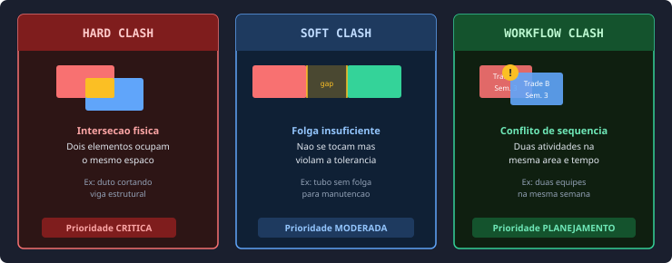
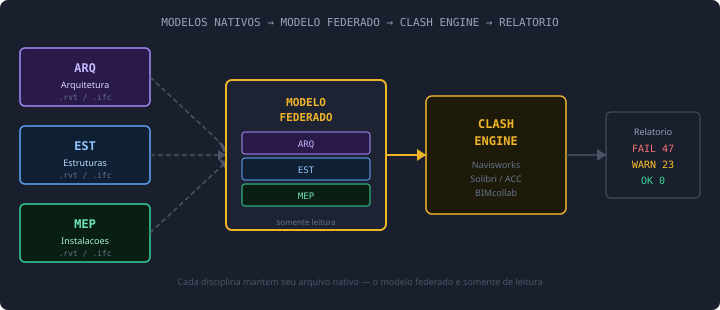
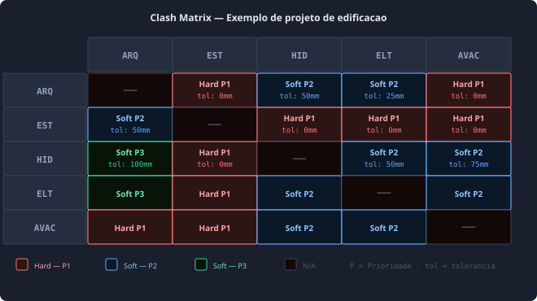
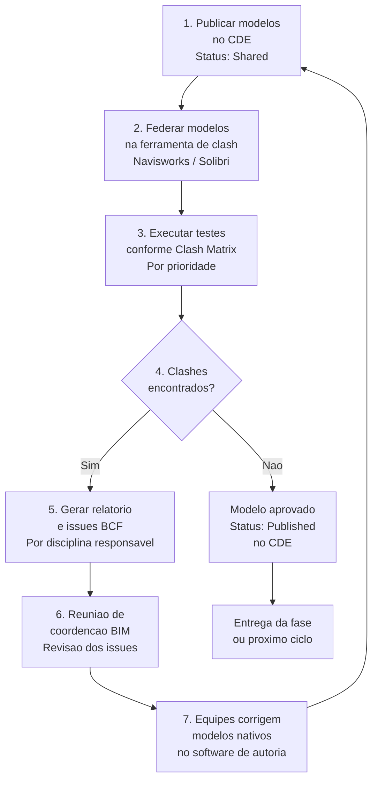
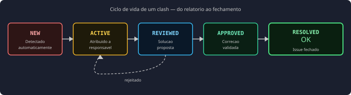

# Clash Detection em BIM

> **Processo de identificação automática de conflitos espaciais** em modelos BIM federados — detectando interferências entre disciplinas antes que se tornem problemas onerosos em obra.

---

## Sumário

1. [O que é Clash Detection](#o-que-é-clash-detection)
2. [Tipos de Clash](#tipos-de-clash)
3. [Modelo Federado](#modelo-federado)
4. [Clash Matrix](#clash-matrix)
5. [Fluxo de trabalho](#fluxo-de-trabalho)
6. [Status e ciclo de vida de um clash](#status-e-ciclo-de-vida-de-um-clash)
7. [Ferramentas](#ferramentas)
8. [Boas práticas](#boas-práticas)
9. [Referências](#referências)

---

## O que é Clash Detection

**Clash Detection** (detecção de conflitos) é o processo de usar modelos BIM coordenados para identificar automaticamente conflitos espaciais — chamados de *clashes* — entre elementos de diferentes disciplinas, como arquitetura, estrutura e sistemas MEP (Mechanical, Electrical and Plumbing), antes do início da construção.[^1]

Em vez de cruzar manualmente pranchas 2D sujeitas a erros, as ferramentas de clash detection varrem um **modelo federado** e geram relatórios detalhados para que as equipes resolvam os conflitos no ambiente digital — não no canteiro de obras.

> Estima-se que corrigir um clash no modelo digital custa até **100 vezes menos** do que corrigi-lo durante a construção.[^2]

---

## Tipos de Clash

Os clashes se dividem em três categorias principais, cada uma exigindo uma abordagem de resolução diferente.[^3]

### Tabela comparativa

| Tipo | Definição | Causa comum | Tolerância típica |
|------|-----------|-------------|------------------|
| **Hard Clash** | Intersecção física entre dois elementos | Falta de coordenação entre modelos de disciplinas diferentes | Zero — qualquer intersecção é inaceitável |
| **Soft Clash** | Violação de folga ou clearance mínimo | Tolerâncias não definidas ou não respeitadas no modelo | Variável: 25–50 mm (tubulação), 600–1000 mm (acesso para manutenção) |
| **Workflow Clash** (4D) | Conflito de sequenciamento ou cronograma | Planejamento de obra sem integração com o modelo BIM | N/A — trata-se de tempo, não geometria |

---

## Modelo Federado

O clash detection opera sobre um **modelo federado** — a combinação de modelos de diferentes disciplinas em um único ambiente de revisão, sem mesclar os arquivos originais.[^4]

!!! note "Modelo federado ≠ modelo mesclado"
    No modelo federado cada disciplina mantém seu arquivo nativo independente. A ferramenta de clash detection importa os modelos como referências somente de leitura — qualquer correção é feita no arquivo nativo de origem e re-publicada no CDE.[^5]

---

## Clash Matrix

A **Clash Matrix** (Matriz de Conflitos) é um framework estruturado que organiza e prioriza os testes de clash entre diferentes sistemas do edifício.[^6] Ela define quais disciplinas serão verificadas entre si, as tolerâncias por par de sistemas e as responsabilidades de resolução.

### Prioridades recomendadas de teste

| Prioridade | Teste | Justificativa |
|:----------:|-------|--------------|
| **P1** | Estrutura × MEP (ductos principais) | Mais difícil de deslocar — maior impacto em custo |
| **P1** | Estrutura × Arquitetura | Base para todas as outras disciplinas |
| **P2** | MEP × MEP (inter-sistemas) | Alto volume de clashes — exige coordenação específica |
| **P2** | Arquitetura × MEP | Afeta acabamentos e passagens |
| **P3** | Arquitetura × Arquitetura | Geralmente resolvido no próprio modelo |

---

## Fluxo de trabalho

### Frequência recomendada por fase

| Fase | Frequência | Foco |
|------|:----------:|------|
| LP (Levantamento Preliminar) | Quinzenal | Hard clashes entre volumes principais |
| AP (Anteprojeto) | Semanal | Hard + Soft, todos os sistemas |
| EP (Projeto Executivo) | Semanal / por entrega | Hard + Soft + tolerâncias completas |
| Obras | Por atualização as-built | Verificação de conformidade campo × modelo |

---

## Status e ciclo de vida de um clash

Cada clash identificado passa por um ciclo de vida com estados bem definidos.[^7]

| Status | Responsável | Ação esperada |
|--------|-------------|--------------|
| **New** | BIM Coordinator | Triagem: relevante, duplicado ou falso positivo? |
| **Active** | Disciplina responsável | Propor e implementar solução no modelo |
| **Reviewed** | BIM Manager | Validar se a solução resolve o conflito |
| **Approved** | BIM Coordinator | Confirmar no modelo federado atualizado |
| **Resolved** | BIM Manager | Fechar o issue no sistema de rastreamento |

---

---

## Ferramentas

### Detecção e coordenação

| Ferramenta | Fabricante | Tipo | Destaque |
|-----------|-----------|------|---------|
| **Navisworks Manage** | Autodesk | Desktop · Comercial | Padrão da indústria — Hard + Soft clashes, TimeLiner 4D, exportação BCF[^9] |
| **Solibri** | Nemetschek | Desktop · Comercial | Rule-based — excelente para Soft clashes e conformidade com normas[^10] |
| **BIMcollab Zoom** | BIMcollab | Desktop · Freemium | Viewer + clash com gestão de issues BCF integrada[^11] |
| **Autodesk Construction Cloud** | Autodesk | Cloud · Comercial | Model Coordination module — colaboração em tempo real, multi-disciplinar[^9] |
| **Trimble Connect** | Trimble | Cloud · Comercial | Forte em infraestrutura, integração com Tekla Structures[^12] |
| **Revit (Interference Check)** | Autodesk | Desktop · Comercial | Verificação básica dentro do ambiente de autoria, entre modelos linkados[^9] |
| **BonsaiBIM / IfcClash** | IfcOpenShell | Desktop · Open Source | Clash detection nativo em IFC dentro do Blender — exporta resultados em BCF[^13] |

> **BonsaiBIM na prática:** O BonsaiBIM inclui um módulo de clash detection alimentado pela biblioteca `IfcClash` do IfcOpenShell. Diretamente no Blender, é possível federar modelos IFC de diferentes disciplinas, configurar pares de teste com tolerâncias, executar testes hard e soft, e exportar os resultados como arquivo BCF — sem instalar nenhuma ferramenta adicional. Por ser 100% open source e IFC-nativo, o BonsaiBIM permite ao estudante percorrer o ciclo completo de coordenação (federação → clash detection → exportação BCF) em um único ambiente gratuito. A prática do curso utilizará o BonsaiBIM como ferramenta principal para todas essas etapas.

### Gestão de issues / BCF

| Ferramenta | Tipo | Destaque |
|-----------|------|---------|
| **BIMcollab NEXUS** | SaaS · Comercial | Plataforma BCF nativa, integra com todos os authoring tools |
| **Autodesk Construction Cloud** | SaaS · Comercial | Issues integrados ao modelo e ao cronograma |
| **BIM Track** | SaaS · Comercial | Foco em colaboração — dashboard de issues por disciplina |
| **Revizto** | SaaS · Comercial | Visual issue tracking com integração direta ao Revit |
| **BonsaiBIM** | Desktop · Open Source | Painel BCF integrado ao Blender — carrega, navega, edita e salva topics BCF[^13] |

> **BonsaiBIM na prática:** O painel BCF do BonsaiBIM (*BIM > Coordination > BCF*) permite carregar um arquivo `.bcf`, navegar entre topics com um clique — reposicionando a câmera do Blender automaticamente no viewpoint do issue — comentar, alterar status e salvar o arquivo atualizado. Suporta BCF-XML 2.1 e 3.0. Para gestão de volumes maiores de issues, a biblioteca `ifcopenshell.bcf` permite scripts Python que processam arquivos BCF em lote, gerando relatórios de progresso de coordenação. Para detalhes sobre o padrão BCF, consulte o material [**BCF Basics**](../bcf/bcf_basics.md).

---

## Boas práticas

### Antes dos testes

- **Definir a Clash Matrix no BEP:** documentar quais disciplinas serão testadas entre si, tolerâncias e prioridades antes de qualquer modelagem.[^15]
- **Garantir QA/QC dos modelos:** modelos incompletos ou mal classificados geram falsos positivos e clashes irrelevantes. Validar com IDS antes de federar.[^7]
- **Usar o mesmo sistema de coordenadas:** todos os modelos devem usar o ponto de origem compartilhado definido no BEP — um modelo desalinhado invalida todos os testes.[^5]
- **Criar selection sets por sistema:** agrupar elementos por disciplina e sistema (ex: "Ductos de AVAC", "Tubulação hidráulica") para testes mais precisos e rastreáveis.[^14]

### Durante os testes

- **Rodar testes por prioridade:** começar pelos pares de maior impacto (EST × MEP) antes de verificar pares menores — evita sobrecarga de dados.[^15]
- **Definir tolerâncias realistas:** uma tolerância de 25 mm pode eliminar milhares de clashes irrelevantes de insulation e cabos flexíveis.[^14]
- **Agrupar clashes similares:** clashes da mesma causa raiz devem ser agrupados em um único issue — não criar um topic BCF por cada interseção individual. Consulte [BCF Basics](../bcf/bcf_basics.md) para boas práticas de gestão de topics.[^6]

### Após os testes

- **Atribuir responsável e prazo para cada issue:** clashes sem dono não são resolvidos. O topic BCF deve incluir disciplina responsável e data limite — ver [BCF Basics](../bcf/bcf_basics.md).[^7]
- **Re-executar após cada atualização:** uma correção pode introduzir novos clashes — cada ciclo de modelo exige nova rodada de testes.[^2]
- **Manter registro completo:** o histórico de clashes detectados, resolvidos e fechados é documentação contratual valiosa em caso de disputas.[^3]
- **Meta: zero clashes críticos, não zero clashes totais:** clashes de baixa prioridade podem ser aceitos com justificativa — o objetivo é eliminar os que impactam construção e segurança.[^15]

---

## Referências

[^1]: AMC Engineer. *BIM Clash Detection: Types, Process, Benefits & Best Software Tools*. Disponível em: <https://amcengineer.com/bim-clash-detection/>. Acesso em: abr. 2026.

[^2]: Autodesk — Digital Builder. *BIM Clash Detection: A Quick Guide*. Disponível em: <https://www.autodesk.com/blogs/construction/bim-clash-detection/>. Acesso em: abr. 2026.

[^3]: Enginero. *BIM Clash Detection: Hard, Soft & Workflow Clashes Explained*. Disponível em: <https://www.enginero.com/blogs/bim-clash-detection-hard-soft-workflow-clashes/>. Acesso em: abr. 2026.

[^4]: Matterport. *BIM Clash Detection: How To Avoid Construction Conflicts*. Disponível em: <https://matterport.com/blog/bim-clash-detection>. Acesso em: abr. 2026.

[^5]: buildingSMART International. *Clash Detection — Use Case Management*. Disponível em: <https://ucm.buildingsmart.org/en/use-cases/2834/en>. Acesso em: abr. 2026.

[^6]: mawlab. *Clash Matrix — Systematic Conflict Management in BIM Coordination*. Disponível em: <https://mawlab.io/en/services/clash-detection/clash-matrix/>. Acesso em: abr. 2026.

[^7]: BIM Corner. *Clash Detection 101: Preventing Construction Conflicts with BIM*. Disponível em: <https://bimcorner.com/clash-detection-101-preventing-construction-conflicts-with-bim/>. Acesso em: abr. 2026.

[^8]: buildingSMART International. *BCF — BIM Collaboration Format*. Repositório oficial. Disponível em: <https://github.com/buildingSMART/BCF-API>. Acesso em: abr. 2026.

[^9]: Autodesk. *Navisworks Manage — Clash Detection Features*. Disponível em: <https://www.autodesk.com/products/navisworks/features>. Acesso em: abr. 2026.

[^10]: Solibri. *Solibri — Smart BIM Model Checking*. Disponível em: <https://www.solibri.com>. Acesso em: abr. 2026.

[^11]: BIMcollab. *BIMcollab Zoom — Free BIM Viewer with Clash Detection*. Disponível em: <https://www.bimcollab.com/products/bimcollab-zoom/>. Acesso em: abr. 2026.

[^12]: Trimble. *Trimble Connect — Cross-Discipline BIM Coordination*. Disponível em: <https://connect.trimble.com>. Acesso em: abr. 2026.

[^15]: BIM Heroes. *Clash Detection in BIM: From Software Feature to Production Governance*. Disponível em: <https://bimheroes.com/clash-detection-bim/>. Acesso em: abr. 2026.

[^14]: Interscale Education. *A Complete Guide To Navisworks Clash Detection: Rules, Types, And Best Practices*. Disponível em: <https://interscaleedu.com/en/blog/navisworks-clash-detection-guide/>. Acesso em: abr. 2026.

[^13]: IfcOpenShell. *BonsaiBIM — Clash Detection and BCF capabilities*. Disponível em: <https://bonsaibim.org> e <https://docs.ifcopenshell.org>. Acesso em: abr. 2026.
