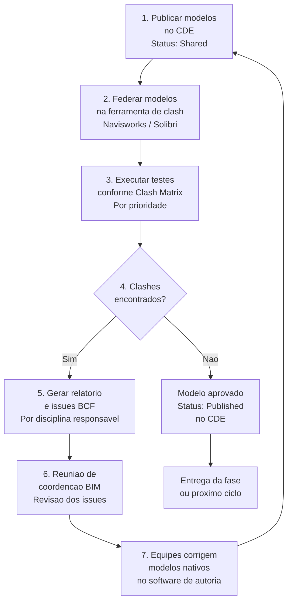
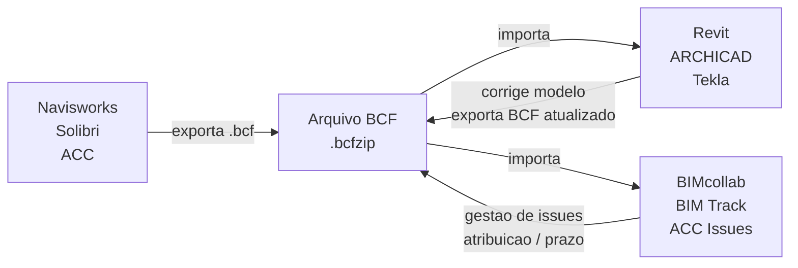

# Clash Detection em BIM

> **Processo de identificação automática de conflitos espaciais** em modelos BIM federados — detectando interferências entre disciplinas antes que se tornem problemas onerosos em obra.

---

## Sumário

1. [O que é Clash Detection](#o-que-é-clash-detection)
2. [Tipos de Clash](#tipos-de-clash)
3. [Modelo Federado](#modelo-federado)
4. [Clash Matrix](#clash-matrix)
5. [Fluxo de trabalho](#fluxo-de-trabalho)
6. [Status e ciclo de vida de um clash](#status-e-ciclo-de-vida-de-um-clash)
7. [BCF — BIM Collaboration Format](#bcf--bim-collaboration-format)
8. [Ferramentas](#ferramentas)
9. [Boas práticas](#boas-práticas)
10. [Referências](#referências)

---

## O que é Clash Detection

**Clash Detection** (detecção de conflitos) é o processo de usar modelos BIM coordenados para identificar automaticamente conflitos espaciais — chamados de *clashes* — entre elementos de diferentes disciplinas, como arquitetura, estrutura e sistemas MEP (Mechanical, Electrical and Plumbing), antes do início da construção.[^1]

Em vez de cruzar manualmente pranchas 2D sujeitas a erros, as ferramentas de clash detection varrem um **modelo federado** e geram relatórios detalhados para que as equipes resolvam os conflitos no ambiente digital — não no canteiro de obras.

> Estima-se que corrigir um clash no modelo digital custa até **100 vezes menos** do que corrigi-lo durante a construção.[^2]

---

## Tipos de Clash

Os clashes se dividem em três categorias principais, cada uma exigindo uma abordagem de resolução diferente.[^3]

<svg viewBox="0 0 740 280" xmlns="http://www.w3.org/2000/svg" style="width:100%;max-width:740px;display:block;margin:1.5rem 0;">
  <rect width="740" height="280" rx="8" fill="#1e2333"/>

  <!-- HARD CLASH -->
  <rect x="20" y="20" width="220" height="240" rx="6" fill="#3b1313" stroke="#f87171" stroke-width="1.5"/>
  <rect x="20" y="20" width="220" height="38" rx="6" fill="#7f1d1d"/>
  <rect x="20" y="46" width="220" height="12" fill="#7f1d1d"/>
  <text x="130" y="44" text-anchor="middle" fill="#fca5a5" font-size="13" font-weight="bold">HARD CLASH</text>
  <rect x="60" y="72" width="65" height="36" rx="3" fill="#f87171"/>
  <rect x="95" y="86" width="65" height="36" rx="3" fill="#60a5fa"/>
  <rect x="95" y="86" width="30" height="22" rx="2" fill="#fbbf24"/>
  <text x="130" y="148" text-anchor="middle" fill="#fca5a5" font-size="11" font-weight="bold">Intersecao fisica</text>
  <text x="130" y="166" text-anchor="middle" fill="#e5e7eb" font-size="10">Dois elementos ocupam</text>
  <text x="130" y="181" text-anchor="middle" fill="#e5e7eb" font-size="10">o mesmo espaco</text>
  <text x="130" y="204" text-anchor="middle" fill="#9ca3af" font-size="9">Ex: duto cortando viga</text>
  <rect x="45" y="222" width="150" height="22" rx="4" fill="#7f1d1d"/>
  <text x="120" y="237" text-anchor="middle" fill="#fca5a5" font-size="10" font-weight="bold">Prioridade CRITICA</text>

  <!-- SOFT CLASH -->
  <rect x="260" y="20" width="220" height="240" rx="6" fill="#1a3350" stroke="#60a5fa" stroke-width="1.5"/>
  <rect x="260" y="20" width="220" height="38" rx="6" fill="#1e3a5f"/>
  <rect x="260" y="46" width="220" height="12" fill="#1e3a5f"/>
  <text x="370" y="44" text-anchor="middle" fill="#93c5fd" font-size="13" font-weight="bold">SOFT CLASH</text>
  <rect x="280" y="72" width="60" height="36" rx="3" fill="#f87171"/>
  <rect x="380" y="72" width="60" height="36" rx="3" fill="#34d399"/>
  <rect x="340" y="72" width="40" height="36" fill="#fbbf24" opacity="0.3"/>
  <line x1="340" y1="72" x2="340" y2="108" stroke="#fbbf24" stroke-width="1.5"/>
  <line x1="380" y1="72" x2="380" y2="108" stroke="#fbbf24" stroke-width="1.5"/>
  <text x="360" y="96" text-anchor="middle" fill="#fbbf24" font-size="8">gap</text>
  <text x="370" y="148" text-anchor="middle" fill="#93c5fd" font-size="11" font-weight="bold">Folga insuficiente</text>
  <text x="370" y="166" text-anchor="middle" fill="#e5e7eb" font-size="10">Nao se tocam mas</text>
  <text x="370" y="181" text-anchor="middle" fill="#e5e7eb" font-size="10">violam a tolerancia</text>
  <text x="370" y="204" text-anchor="middle" fill="#9ca3af" font-size="9">Ex: tubo sem folga p/ manut.</text>
  <rect x="285" y="222" width="170" height="22" rx="4" fill="#1e3a5f"/>
  <text x="370" y="237" text-anchor="middle" fill="#93c5fd" font-size="10" font-weight="bold">Prioridade MODERADA</text>

  <!-- WORKFLOW CLASH -->
  <rect x="500" y="20" width="220" height="240" rx="6" fill="#1a2e1a" stroke="#34d399" stroke-width="1.5"/>
  <rect x="500" y="20" width="220" height="38" rx="6" fill="#1e3d1e"/>
  <rect x="500" y="46" width="220" height="12" fill="#1e3d1e"/>
  <text x="610" y="44" text-anchor="middle" fill="#6ee7b7" font-size="13" font-weight="bold">WORKFLOW CLASH</text>
  <rect x="530" y="72" width="60" height="36" rx="3" fill="#f87171" opacity="0.9"/>
  <text x="560" y="87" text-anchor="middle" fill="white" font-size="8">Trade A</text>
  <text x="560" y="100" text-anchor="middle" fill="white" font-size="8">Sem. 3</text>
  <rect x="565" y="80" width="60" height="36" rx="3" fill="#60a5fa" opacity="0.9"/>
  <text x="595" y="95" text-anchor="middle" fill="white" font-size="8">Trade B</text>
  <text x="595" y="108" text-anchor="middle" fill="white" font-size="8">Sem. 3</text>
  <circle cx="566" cy="80" r="9" fill="#fbbf24"/>
  <text x="566" y="84" text-anchor="middle" fill="#1e2333" font-size="11" font-weight="bold">!</text>
  <text x="610" y="148" text-anchor="middle" fill="#6ee7b7" font-size="11" font-weight="bold">Conflito de sequencia</text>
  <text x="610" y="166" text-anchor="middle" fill="#e5e7eb" font-size="10">Duas atividades na</text>
  <text x="610" y="181" text-anchor="middle" fill="#e5e7eb" font-size="10">mesma area e tempo (4D)</text>
  <text x="610" y="204" text-anchor="middle" fill="#9ca3af" font-size="9">Ex: duas equipes na sem. 3</text>
  <rect x="520" y="222" width="180" height="22" rx="4" fill="#1e3d1e"/>
  <text x="610" y="237" text-anchor="middle" fill="#6ee7b7" font-size="10" font-weight="bold">Prioridade PLANEJAMENTO</text>
</svg>

### Tabela comparativa

| Tipo | Definição | Causa comum | Tolerância típica |
|------|-----------|-------------|------------------|
| **Hard Clash** | Intersecção física entre dois elementos | Falta de coordenação entre modelos de disciplinas diferentes | Zero — qualquer intersecção é inaceitável |
| **Soft Clash** | Violação de folga ou clearance mínimo | Tolerâncias não definidas ou não respeitadas no modelo | Variável: 25–50 mm (tubulação), 600–1000 mm (acesso para manutenção) |
| **Workflow Clash** (4D) | Conflito de sequenciamento ou cronograma | Planejamento de obra sem integração com o modelo BIM | N/A — trata-se de tempo, não geometria |

---

## Modelo Federado

O clash detection opera sobre um **modelo federado** — a combinação de modelos de diferentes disciplinas em um único ambiente de revisão, sem mesclar os arquivos originais.[^4]

<svg viewBox="0 0 720 340" xmlns="http://www.w3.org/2000/svg" font-family="ui-monospace,SFMono-Regular,monospace" style="width:100%;max-width:720px;display:block;margin:1.5rem 0;">
  <rect width="720" height="340" rx="8" fill="#1e2333"/>

  <!-- Discipline models -->
  <rect x="30" y="40" width="120" height="70" rx="5" fill="#3a1f5a" stroke="#a78bfa" stroke-width="1.5"/>
  <text x="90" y="65" text-anchor="middle" fill="#c4b5fd" font-size="11" font-weight="bold">ARQ</text>
  <text x="90" y="82" text-anchor="middle" fill="#ddd6fe" font-size="9">Arquitetura</text>
  <text x="90" y="96" text-anchor="middle" fill="#9ca3af" font-size="8">.rvt / .ifc</text>

  <rect x="30" y="135" width="120" height="70" rx="5" fill="#1e3a5f" stroke="#60a5fa" stroke-width="1.5"/>
  <text x="90" y="160" text-anchor="middle" fill="#93c5fd" font-size="11" font-weight="bold">EST</text>
  <text x="90" y="177" text-anchor="middle" fill="#bfdbfe" font-size="9">Estruturas</text>
  <text x="90" y="191" text-anchor="middle" fill="#9ca3af" font-size="8">.rvt / .ifc</text>

  <rect x="30" y="230" width="120" height="70" rx="5" fill="#1a3320" stroke="#34d399" stroke-width="1.5"/>
  <text x="90" y="255" text-anchor="middle" fill="#6ee7b7" font-size="11" font-weight="bold">MEP</text>
  <text x="90" y="272" text-anchor="middle" fill="#a7f3d0" font-size="9">Instalacoes</text>
  <text x="90" y="286" text-anchor="middle" fill="#9ca3af" font-size="8">.rvt / .ifc</text>

  <!-- Arrows to federated -->
  <line x1="150" y1="75" x2="240" y2="165" stroke="#6b7280" stroke-width="1.5" stroke-dasharray="4,3"/>
  <polygon points="240,165 230,158 236,170" fill="#6b7280"/>
  <line x1="150" y1="170" x2="240" y2="170" stroke="#6b7280" stroke-width="1.5" stroke-dasharray="4,3"/>
  <polygon points="240,170 230,165 230,175" fill="#6b7280"/>
  <line x1="150" y1="265" x2="240" y2="175" stroke="#6b7280" stroke-width="1.5" stroke-dasharray="4,3"/>
  <polygon points="240,175 230,172 236,183" fill="#6b7280"/>

  <!-- Federated model box -->
  <rect x="240" y="90" width="160" height="160" rx="6" fill="#2a2f3e" stroke="#f0b429" stroke-width="2"/>
  <!-- nested discipline outlines -->
  <rect x="255" y="105" width="130" height="35" rx="3" fill="#3a1f5a" stroke="#a78bfa" stroke-width="1" opacity="0.8"/>
  <text x="320" y="128" text-anchor="middle" fill="#c4b5fd" font-size="9">ARQ</text>
  <rect x="255" y="148" width="130" height="35" rx="3" fill="#1e3a5f" stroke="#60a5fa" stroke-width="1" opacity="0.8"/>
  <text x="320" y="171" text-anchor="middle" fill="#93c5fd" font-size="9">EST</text>
  <rect x="255" y="191" width="130" height="35" rx="3" fill="#1a3320" stroke="#34d399" stroke-width="1" opacity="0.8"/>
  <text x="320" y="214" text-anchor="middle" fill="#6ee7b7" font-size="9">MEP</text>
  <text x="320" y="265" text-anchor="middle" fill="#f0b429" font-size="11" font-weight="bold">MODELO</text>
  <text x="320" y="280" text-anchor="middle" fill="#f0b429" font-size="11" font-weight="bold">FEDERADO</text>

  <!-- Arrow to clash engine -->
  <line x1="400" y1="170" x2="460" y2="170" stroke="#f0b429" stroke-width="2"/>
  <polygon points="460,170 450,164 450,176" fill="#f0b429"/>

  <!-- Clash engine -->
  <rect x="460" y="110" width="130" height="120" rx="6" fill="#2d2010" stroke="#f0b429" stroke-width="1.5"/>
  <text x="525" y="145" text-anchor="middle" fill="#f0b429" font-size="10" font-weight="bold">CLASH</text>
  <text x="525" y="162" text-anchor="middle" fill="#f0b429" font-size="10" font-weight="bold">ENGINE</text>
  <text x="525" y="184" text-anchor="middle" fill="#9ca3af" font-size="8">Navisworks</text>
  <text x="525" y="198" text-anchor="middle" fill="#9ca3af" font-size="8">Solibri / ACC</text>
  <text x="525" y="212" text-anchor="middle" fill="#9ca3af" font-size="8">BIMcollab</text>

  <!-- Arrow to report -->
  <line x1="590" y1="170" x2="640" y2="170" stroke="#6b7280" stroke-width="1.5"/>
  <polygon points="640,170 630,164 630,176" fill="#6b7280"/>

  <!-- Report box -->
  <rect x="640" y="130" width="60" height="80" rx="4" fill="#1e2333" stroke="#6b7280" stroke-width="1"/>
  <text x="670" y="158" text-anchor="middle" fill="#e5e7eb" font-size="8">Relatorio</text>
  <text x="670" y="173" text-anchor="middle" fill="#f87171" font-size="9">✗ 47</text>
  <text x="670" y="188" text-anchor="middle" fill="#60a5fa" font-size="9">⚠ 23</text>
  <text x="670" y="202" text-anchor="middle" fill="#34d399" font-size="9">✓ 0</text>

  <!-- Labels -->
  <text x="90" y="320" text-anchor="middle" fill="#6b7280" font-size="9">Modelos nativos</text>
  <text x="90" y="332" text-anchor="middle" fill="#6b7280" font-size="9">por disciplina</text>
  <text x="320" y="310" text-anchor="middle" fill="#6b7280" font-size="9">Federado (somente leitura)</text>
  <text x="320" y="322" text-anchor="middle" fill="#6b7280" font-size="9">sem mesclar arquivos</text>
</svg>

!!! note "Modelo federado ≠ modelo mesclado"
    No modelo federado cada disciplina mantém seu arquivo nativo independente. A ferramenta de clash detection importa os modelos como referências somente de leitura — qualquer correção é feita no arquivo nativo de origem e re-publicada no CDE.[^5]

---

## Clash Matrix

A **Clash Matrix** (Matriz de Conflitos) é um framework estruturado que organiza e prioriza os testes de clash entre diferentes sistemas do edifício.[^6] Ela define quais disciplinas serão verificadas entre si, as tolerâncias por par de sistemas e as responsabilidades de resolução.

<svg viewBox="0 0 680 380" xmlns="http://www.w3.org/2000/svg" font-family="ui-monospace,SFMono-Regular,monospace" style="width:100%;max-width:680px;display:block;margin:1.5rem 0;">
  <rect width="680" height="380" rx="8" fill="#1e2333"/>
  <text x="340" y="30" text-anchor="middle" fill="#e5e7eb" font-size="13" font-weight="bold">Clash Matrix — Exemplo de projeto de edificacao</text>

  <!-- header row -->
  <rect x="120" y="50" width="100" height="36" rx="3" fill="#2a2f3e" stroke="#374151"/>
  <text x="170" y="73" text-anchor="middle" fill="#9ca3af" font-size="9">ARQ</text>
  <rect x="222" y="50" width="100" height="36" rx="3" fill="#2a2f3e" stroke="#374151"/>
  <text x="272" y="73" text-anchor="middle" fill="#9ca3af" font-size="9">EST</text>
  <rect x="324" y="50" width="100" height="36" rx="3" fill="#2a2f3e" stroke="#374151"/>
  <text x="374" y="73" text-anchor="middle" fill="#9ca3af" font-size="9">HID</text>
  <rect x="426" y="50" width="100" height="36" rx="3" fill="#2a2f3e" stroke="#374151"/>
  <text x="476" y="73" text-anchor="middle" fill="#9ca3af" font-size="9">ELT</text>
  <rect x="528" y="50" width="100" height="36" rx="3" fill="#2a2f3e" stroke="#374151"/>
  <text x="578" y="73" text-anchor="middle" fill="#9ca3af" font-size="9">AVAC</text>

  <!-- row labels -->
  <!-- ARQ -->
  <rect x="20" y="88" width="98" height="44" rx="3" fill="#2a2f3e" stroke="#374151"/>
  <text x="69" y="115" text-anchor="middle" fill="#9ca3af" font-size="9">ARQ</text>

  <!-- EST -->
  <rect x="20" y="134" width="98" height="44" rx="3" fill="#2a2f3e" stroke="#374151"/>
  <text x="69" y="161" text-anchor="middle" fill="#9ca3af" font-size="9">EST</text>

  <!-- HID -->
  <rect x="20" y="180" width="98" height="44" rx="3" fill="#2a2f3e" stroke="#374151"/>
  <text x="69" y="207" text-anchor="middle" fill="#9ca3af" font-size="9">HID</text>

  <!-- ELT -->
  <rect x="20" y="226" width="98" height="44" rx="3" fill="#2a2f3e" stroke="#374151"/>
  <text x="69" y="253" text-anchor="middle" fill="#9ca3af" font-size="9">ELT</text>

  <!-- AVAC -->
  <rect x="20" y="272" width="98" height="44" rx="3" fill="#2a2f3e" stroke="#374151"/>
  <text x="69" y="299" text-anchor="middle" fill="#9ca3af" font-size="9">AVAC</text>

  <!-- Matrix cells — row ARQ -->
  <!-- ARQ x ARQ: diagonal / N/A -->
  <rect x="120" y="88" width="100" height="44" rx="2" fill="#111827" stroke="#374151"/>
  <text x="170" y="115" text-anchor="middle" fill="#4b5563" font-size="14">—</text>

  <!-- ARQ x EST: Hard, P1 -->
  <rect x="222" y="88" width="100" height="44" rx="2" fill="#3b1313" stroke="#f87171" stroke-width="1.2"/>
  <text x="272" y="108" text-anchor="middle" fill="#fca5a5" font-size="9" font-weight="bold">Hard</text>
  <text x="272" y="122" text-anchor="middle" fill="#f87171" font-size="8">P1 · tol: 0mm</text>

  <!-- ARQ x HID: Soft -->
  <rect x="324" y="88" width="100" height="44" rx="2" fill="#1a3350" stroke="#60a5fa" stroke-width="1.2"/>
  <text x="374" y="108" text-anchor="middle" fill="#93c5fd" font-size="9" font-weight="bold">Soft</text>
  <text x="374" y="122" text-anchor="middle" fill="#60a5fa" font-size="8">P2 · tol: 50mm</text>

  <!-- ARQ x ELT: Soft -->
  <rect x="426" y="88" width="100" height="44" rx="2" fill="#1a3350" stroke="#60a5fa" stroke-width="1.2"/>
  <text x="476" y="108" text-anchor="middle" fill="#93c5fd" font-size="9" font-weight="bold">Soft</text>
  <text x="476" y="122" text-anchor="middle" fill="#60a5fa" font-size="8">P2 · tol: 25mm</text>

  <!-- ARQ x AVAC: Hard -->
  <rect x="528" y="88" width="100" height="44" rx="2" fill="#3b1313" stroke="#f87171" stroke-width="1.2"/>
  <text x="578" y="108" text-anchor="middle" fill="#fca5a5" font-size="9" font-weight="bold">Hard</text>
  <text x="578" y="122" text-anchor="middle" fill="#f87171" font-size="8">P1 · tol: 0mm</text>

  <!-- row EST -->
  <rect x="120" y="134" width="100" height="44" rx="2" fill="#1a3350" stroke="#60a5fa" stroke-width="1.2"/>
  <text x="170" y="154" text-anchor="middle" fill="#93c5fd" font-size="9" font-weight="bold">Soft</text>
  <text x="170" y="168" text-anchor="middle" fill="#60a5fa" font-size="8">P2 · tol: 50mm</text>

  <rect x="222" y="134" width="100" height="44" rx="2" fill="#111827" stroke="#374151"/>
  <text x="272" y="161" text-anchor="middle" fill="#4b5563" font-size="14">—</text>

  <rect x="324" y="134" width="100" height="44" rx="2" fill="#3b1313" stroke="#f87171" stroke-width="1.2"/>
  <text x="374" y="154" text-anchor="middle" fill="#fca5a5" font-size="9" font-weight="bold">Hard</text>
  <text x="374" y="168" text-anchor="middle" fill="#f87171" font-size="8">P1 · tol: 0mm</text>

  <rect x="426" y="134" width="100" height="44" rx="2" fill="#3b1313" stroke="#f87171" stroke-width="1.2"/>
  <text x="476" y="154" text-anchor="middle" fill="#fca5a5" font-size="9" font-weight="bold">Hard</text>
  <text x="476" y="168" text-anchor="middle" fill="#f87171" font-size="8">P1 · tol: 0mm</text>

  <rect x="528" y="134" width="100" height="44" rx="2" fill="#3b1313" stroke="#f87171" stroke-width="1.2"/>
  <text x="578" y="154" text-anchor="middle" fill="#fca5a5" font-size="9" font-weight="bold">Hard</text>
  <text x="578" y="168" text-anchor="middle" fill="#f87171" font-size="8">P1 · tol: 0mm</text>

  <!-- row HID -->
  <rect x="120" y="180" width="100" height="44" rx="2" fill="#1a2e1a" stroke="#34d399" stroke-width="1.2"/>
  <text x="170" y="200" text-anchor="middle" fill="#6ee7b7" font-size="9" font-weight="bold">Soft</text>
  <text x="170" y="214" text-anchor="middle" fill="#34d399" font-size="8">P3 · tol: 100mm</text>

  <rect x="222" y="180" width="100" height="44" rx="2" fill="#3b1313" stroke="#f87171" stroke-width="1.2"/>
  <text x="272" y="200" text-anchor="middle" fill="#fca5a5" font-size="9" font-weight="bold">Hard</text>
  <text x="272" y="214" text-anchor="middle" fill="#f87171" font-size="8">P1 · tol: 0mm</text>

  <rect x="324" y="180" width="100" height="44" rx="2" fill="#111827" stroke="#374151"/>
  <text x="374" y="207" text-anchor="middle" fill="#4b5563" font-size="14">—</text>

  <rect x="426" y="180" width="100" height="44" rx="2" fill="#1a3350" stroke="#60a5fa" stroke-width="1.2"/>
  <text x="476" y="200" text-anchor="middle" fill="#93c5fd" font-size="9" font-weight="bold">Soft</text>
  <text x="476" y="214" text-anchor="middle" fill="#60a5fa" font-size="8">P2 · tol: 50mm</text>

  <rect x="528" y="180" width="100" height="44" rx="2" fill="#1a3350" stroke="#60a5fa" stroke-width="1.2"/>
  <text x="578" y="200" text-anchor="middle" fill="#93c5fd" font-size="9" font-weight="bold">Soft</text>
  <text x="578" y="214" text-anchor="middle" fill="#60a5fa" font-size="8">P2 · tol: 75mm</text>

  <!-- row ELT — abbreviated -->
  <rect x="120" y="226" width="100" height="44" rx="2" fill="#1a2e1a" stroke="#34d399" stroke-width="1.2"/>
  <text x="170" y="252" text-anchor="middle" fill="#6ee7b7" font-size="9" font-weight="bold">Soft P3</text>
  <rect x="222" y="226" width="100" height="44" rx="2" fill="#3b1313" stroke="#f87171" stroke-width="1.2"/>
  <text x="272" y="252" text-anchor="middle" fill="#fca5a5" font-size="9" font-weight="bold">Hard P1</text>
  <rect x="324" y="226" width="100" height="44" rx="2" fill="#1a3350" stroke="#60a5fa" stroke-width="1.2"/>
  <text x="374" y="252" text-anchor="middle" fill="#93c5fd" font-size="9" font-weight="bold">Soft P2</text>
  <rect x="426" y="226" width="100" height="44" rx="2" fill="#111827" stroke="#374151"/>
  <text x="476" y="253" text-anchor="middle" fill="#4b5563" font-size="14">—</text>
  <rect x="528" y="226" width="100" height="44" rx="2" fill="#1a3350" stroke="#60a5fa" stroke-width="1.2"/>
  <text x="578" y="252" text-anchor="middle" fill="#93c5fd" font-size="9" font-weight="bold">Soft P2</text>

  <!-- row AVAC -->
  <rect x="120" y="272" width="100" height="44" rx="2" fill="#3b1313" stroke="#f87171" stroke-width="1.2"/>
  <text x="170" y="298" text-anchor="middle" fill="#fca5a5" font-size="9" font-weight="bold">Hard P1</text>
  <rect x="222" y="272" width="100" height="44" rx="2" fill="#3b1313" stroke="#f87171" stroke-width="1.2"/>
  <text x="272" y="298" text-anchor="middle" fill="#fca5a5" font-size="9" font-weight="bold">Hard P1</text>
  <rect x="324" y="272" width="100" height="44" rx="2" fill="#1a3350" stroke="#60a5fa" stroke-width="1.2"/>
  <text x="374" y="298" text-anchor="middle" fill="#93c5fd" font-size="9" font-weight="bold">Soft P2</text>
  <rect x="426" y="272" width="100" height="44" rx="2" fill="#1a3350" stroke="#60a5fa" stroke-width="1.2"/>
  <text x="476" y="298" text-anchor="middle" fill="#93c5fd" font-size="9" font-weight="bold">Soft P2</text>
  <rect x="528" y="272" width="100" height="44" rx="2" fill="#111827" stroke="#374151"/>
  <text x="578" y="299" text-anchor="middle" fill="#4b5563" font-size="14">—</text>

  <!-- Legend -->
  <rect x="20" y="332" width="12" height="12" rx="2" fill="#3b1313" stroke="#f87171"/>
  <text x="38" y="343" fill="#fca5a5" font-size="9">Hard · Prioridade 1</text>
  <rect x="170" y="332" width="12" height="12" rx="2" fill="#1a3350" stroke="#60a5fa"/>
  <text x="188" y="343" fill="#93c5fd" font-size="9">Soft · Prioridade 2/3</text>
  <rect x="330" y="332" width="12" height="12" rx="2" fill="#111827" stroke="#374151"/>
  <text x="348" y="343" fill="#6b7280" font-size="9">Nao aplicavel</text>
  <text x="500" y="343" fill="#6b7280" font-size="9">P = Prioridade · tol = tolerancia</text>
</svg>

### Prioridades recomendadas de teste

| Prioridade | Teste | Justificativa |
|:----------:|-------|--------------|
| **P1** | Estrutura × MEP (ductos principais) | Mais difícil de deslocar — maior impacto em custo |
| **P1** | Estrutura × Arquitetura | Base para todas as outras disciplinas |
| **P2** | MEP × MEP (inter-sistemas) | Alto volume de clashes — exige coordenação específica |
| **P2** | Arquitetura × MEP | Afeta acabamentos e passagens |
| **P3** | Arquitetura × Arquitetura | Geralmente resolvido no próprio modelo |

---

## Fluxo de trabalho

### Frequência recomendada por fase

| Fase | Frequência | Foco |
|------|:----------:|------|
| LP (Levantamento Preliminar) | Quinzenal | Hard clashes entre volumes principais |
| AP (Anteprojeto) | Semanal | Hard + Soft, todos os sistemas |
| EP (Projeto Executivo) | Semanal / por entrega | Hard + Soft + tolerâncias completas |
| Obras | Por atualização as-built | Verificação de conformidade campo × modelo |

---

## Status e ciclo de vida de um clash

Cada clash identificado passa por um ciclo de vida com estados bem definidos.[^7]

<svg viewBox="0 0 700 200" xmlns="http://www.w3.org/2000/svg" font-family="ui-monospace,SFMono-Regular,monospace" style="width:100%;max-width:700px;display:block;margin:1.5rem 0;">
  <rect width="700" height="200" rx="8" fill="#1e2333"/>

  <!-- States -->
  <!-- New -->
  <rect x="20" y="70" width="100" height="60" rx="6" fill="#3b1313" stroke="#f87171" stroke-width="1.5"/>
  <text x="70" y="95" text-anchor="middle" fill="#fca5a5" font-size="10" font-weight="bold">NEW</text>
  <text x="70" y="112" text-anchor="middle" fill="#9ca3af" font-size="8">Detectado</text>
  <text x="70" y="124" text-anchor="middle" fill="#9ca3af" font-size="8">automaticamente</text>

  <!-- Arrow New -> Active -->
  <line x1="120" y1="100" x2="155" y2="100" stroke="#6b7280" stroke-width="1.5"/>
  <polygon points="155,100 147,95 147,105" fill="#6b7280"/>

  <!-- Active -->
  <rect x="155" y="70" width="100" height="60" rx="6" fill="#2d2010" stroke="#f0b429" stroke-width="1.5"/>
  <text x="205" y="95" text-anchor="middle" fill="#fcd34d" font-size="10" font-weight="bold">ACTIVE</text>
  <text x="205" y="112" text-anchor="middle" fill="#9ca3af" font-size="8">Atribuido a</text>
  <text x="205" y="124" text-anchor="middle" fill="#9ca3af" font-size="8">responsavel</text>

  <!-- Arrow Active -> Reviewed -->
  <line x1="255" y1="100" x2="290" y2="100" stroke="#6b7280" stroke-width="1.5"/>
  <polygon points="290,100 282,95 282,105" fill="#6b7280"/>

  <!-- Reviewed -->
  <rect x="290" y="70" width="100" height="60" rx="6" fill="#1a2e3a" stroke="#38bdf8" stroke-width="1.5"/>
  <text x="340" y="95" text-anchor="middle" fill="#7dd3fc" font-size="10" font-weight="bold">REVIEWED</text>
  <text x="340" y="112" text-anchor="middle" fill="#9ca3af" font-size="8">Solucao proposta</text>
  <text x="340" y="124" text-anchor="middle" fill="#9ca3af" font-size="8">aguardando aprovacao</text>

  <!-- Arrow back to Active (rejected) -->
  <path d="M340,130 Q340,165 205,165 Q170,165 205,130" fill="none" stroke="#6b7280" stroke-width="1.2" stroke-dasharray="3,2"/>
  <polygon points="205,130 199,138 211,138" fill="#6b7280"/>
  <text x="272" y="180" text-anchor="middle" fill="#6b7280" font-size="8">Solucao rejeitada</text>

  <!-- Arrow Reviewed -> Approved -->
  <line x1="390" y1="100" x2="425" y2="100" stroke="#6b7280" stroke-width="1.5"/>
  <polygon points="425,100 417,95 417,105" fill="#6b7280"/>

  <!-- Approved -->
  <rect x="425" y="70" width="100" height="60" rx="6" fill="#1a3320" stroke="#34d399" stroke-width="1.5"/>
  <text x="475" y="95" text-anchor="middle" fill="#6ee7b7" font-size="10" font-weight="bold">APPROVED</text>
  <text x="475" y="112" text-anchor="middle" fill="#9ca3af" font-size="8">Correcao validada</text>
  <text x="475" y="124" text-anchor="middle" fill="#9ca3af" font-size="8">no modelo</text>

  <!-- Arrow Approved -> Resolved -->
  <line x1="525" y1="100" x2="560" y2="100" stroke="#6b7280" stroke-width="1.5"/>
  <polygon points="560,100 552,95 552,105" fill="#6b7280"/>

  <!-- Resolved -->
  <rect x="560" y="70" width="120" height="60" rx="6" fill="#1a2e1a" stroke="#4ade80" stroke-width="2"/>
  <text x="620" y="92" text-anchor="middle" fill="#86efac" font-size="10" font-weight="bold">RESOLVED</text>
  <text x="620" y="108" text-anchor="middle" fill="#86efac" font-size="9">✓</text>
  <text x="620" y="122" text-anchor="middle" fill="#9ca3af" font-size="8">Issue fechado</text>

  <!-- Labels at top -->
  <text x="350" y="22" text-anchor="middle" fill="#6b7280" font-size="10">Ciclo de vida de um clash — do relatorio ao fechamento</text>
</svg>

| Status | Responsável | Ação esperada |
|--------|-------------|--------------|
| **New** | BIM Coordinator | Triagem: relevante, duplicado ou falso positivo? |
| **Active** | Disciplina responsável | Propor e implementar solução no modelo |
| **Reviewed** | BIM Manager | Validar se a solução resolve o conflito |
| **Approved** | BIM Coordinator | Confirmar no modelo federado atualizado |
| **Resolved** | BIM Manager | Fechar o issue no sistema de rastreamento |

---

## BCF — BIM Collaboration Format

O **BCF (BIM Collaboration Format)** é o padrão aberto da buildingSMART para comunicar issues baseados em modelo — incluindo clashes — entre diferentes ferramentas e equipes.[^8]

Um arquivo BCF (`.bcf` ou `.bcfzip`) contém para cada issue:

- **Viewpoint** — ponto de vista 3D com a câmera posicionada no clash
- **Snapshot** — imagem do clash no contexto do modelo
- **Componentes** — GUIDs dos elementos IFC envolvidos no conflito
- **Metadados** — título, descrição, status, prioridade, responsável, prazo

!!! tip "BCF vs e-mail"
    O BCF elimina o ciclo de e-mails com prints de tela. Cada issue carrega a posição exata da câmera no modelo — o destinatário clica e navega diretamente ao clash, sem precisar localizar o problema manualmente.[^8]

---

## Ferramentas

### Detecção e coordenação

| Ferramenta | Fabricante | Tipo | Destaque |
|-----------|-----------|------|---------|
| **Navisworks Manage** | Autodesk | Desktop · Comercial | Padrão da indústria — Hard + Soft clashes, TimeLiner 4D, exportação BCF[^9] |
| **Solibri** | Nemetschek | Desktop · Comercial | Rule-based — excelente para Soft clashes e conformidade com normas[^10] |
| **BIMcollab Zoom** | BIMcollab | Desktop · Freemium | Viewer + clash com gestão de issues BCF integrada[^11] |
| **Autodesk Construction Cloud** | Autodesk | Cloud · Comercial | Model Coordination module — colaboração em tempo real, multi-disciplinar[^9] |
| **Trimble Connect** | Trimble | Cloud · Comercial | Forte em infraestrutura, integração com Tekla Structures[^12] |
| **Revit (Interference Check)** | Autodesk | Desktop · Comercial | Verificação básica dentro do ambiente de autoria, entre modelos linkados[^9] |

### Gestão de issues / BCF

| Ferramenta | Tipo | Destaque |
|-----------|------|---------|
| **BIMcollab NEXUS** | SaaS · Comercial | Plataforma BCF nativa, integra com todos os authoring tools |
| **Autodesk Construction Cloud** | SaaS · Comercial | Issues integrados ao modelo e ao cronograma |
| **BIM Track** | SaaS · Comercial | Foco em colaboração — dashboard de issues por disciplina |
| **Revizto** | SaaS · Comercial | Visual issue tracking com integração direta ao Revit |

---

## Boas práticas

### Antes dos testes

- **Definir a Clash Matrix no BEP:** documentar quais disciplinas serão testadas entre si, tolerâncias e prioridades antes de qualquer modelagem.[^13]
- **Garantir QA/QC dos modelos:** modelos incompletos ou mal classificados geram falsos positivos e clashes irrelevantes. Validar com IDS antes de federar.[^7]
- **Usar o mesmo sistema de coordenadas:** todos os modelos devem usar o ponto de origem compartilhado definido no BEP — um modelo desalinhado invalida todos os testes.[^5]
- **Criar selection sets por sistema:** agrupar elementos por disciplina e sistema (ex: "Ductos de AVAC", "Tubulação hidráulica") para testes mais precisos e rastreáveis.[^14]

### Durante os testes

- **Rodar testes por prioridade:** começar pelos pares de maior impacto (EST × MEP) antes de verificar pares menores — evita sobrecarga de dados.[^13]
- **Definir tolerâncias realistas:** uma tolerância de 25 mm pode eliminar milhares de clashes irrelevantes de insulation e cabos flexíveis.[^14]
- **Agrupar clashes similares:** clashes da mesma causa raiz devem ser agrupados em um único issue — não criar um BCF por cada interseção individual.[^6]

### Após os testes

- **Atribuir responsável e prazo para cada issue:** clashes sem dono não são resolvidos. O BCF deve incluir disciplina responsável e data limite.[^7]
- **Re-executar após cada atualização:** uma correção pode introduzir novos clashes — cada ciclo de modelo exige nova rodada de testes.[^2]
- **Manter registro completo:** o histórico de clashes detectados, resolvidos e fechados é documentação contratual valiosa em caso de disputas.[^3]
- **Meta: zero clashes críticos, não zero clashes totais:** clashes de baixa prioridade podem ser aceitos com justificativa — o objetivo é eliminar os que impactam construção e segurança.[^13]

---

## Referências

[^1]: AMC Engineer. *BIM Clash Detection: Types, Process, Benefits & Best Software Tools*. Disponível em: <https://amcengineer.com/bim-clash-detection/>. Acesso em: abr. 2026.

[^2]: Autodesk — Digital Builder. *BIM Clash Detection: A Quick Guide*. Disponível em: <https://www.autodesk.com/blogs/construction/bim-clash-detection/>. Acesso em: abr. 2026.

[^3]: Enginero. *BIM Clash Detection: Hard, Soft & Workflow Clashes Explained*. Disponível em: <https://www.enginero.com/blogs/bim-clash-detection-hard-soft-workflow-clashes/>. Acesso em: abr. 2026.

[^4]: Matterport. *BIM Clash Detection: How To Avoid Construction Conflicts*. Disponível em: <https://matterport.com/blog/bim-clash-detection>. Acesso em: abr. 2026.

[^5]: buildingSMART International. *Clash Detection — Use Case Management*. Disponível em: <https://ucm.buildingsmart.org/en/use-cases/2834/en>. Acesso em: abr. 2026.

[^6]: mawlab. *Clash Matrix — Systematic Conflict Management in BIM Coordination*. Disponível em: <https://mawlab.io/en/services/clash-detection/clash-matrix/>. Acesso em: abr. 2026.

[^7]: BIM Corner. *Clash Detection 101: Preventing Construction Conflicts with BIM*. Disponível em: <https://bimcorner.com/clash-detection-101-preventing-construction-conflicts-with-bim/>. Acesso em: abr. 2026.

[^8]: buildingSMART International. *BCF — BIM Collaboration Format*. Repositório oficial. Disponível em: <https://github.com/buildingSMART/BCF-API>. Acesso em: abr. 2026.

[^9]: Autodesk. *Navisworks Manage — Clash Detection Features*. Disponível em: <https://www.autodesk.com/products/navisworks/features>. Acesso em: abr. 2026.

[^10]: Solibri. *Solibri — Smart BIM Model Checking*. Disponível em: <https://www.solibri.com>. Acesso em: abr. 2026.

[^11]: BIMcollab. *BIMcollab Zoom — Free BIM Viewer with Clash Detection*. Disponível em: <https://www.bimcollab.com/products/bimcollab-zoom/>. Acesso em: abr. 2026.

[^12]: Trimble. *Trimble Connect — Cross-Discipline BIM Coordination*. Disponível em: <https://connect.trimble.com>. Acesso em: abr. 2026.

[^13]: BIM Heroes. *Clash Detection in BIM: From Software Feature to Production Governance*. Disponível em: <https://bimheroes.com/clash-detection-bim/>. Acesso em: abr. 2026.

[^14]: Interscale Education. *A Complete Guide To Navisworks Clash Detection: Rules, Types, And Best Practices*. Disponível em: <https://interscaleedu.com/en/blog/navisworks-clash-detection-guide/>. Acesso em: abr. 2026.
