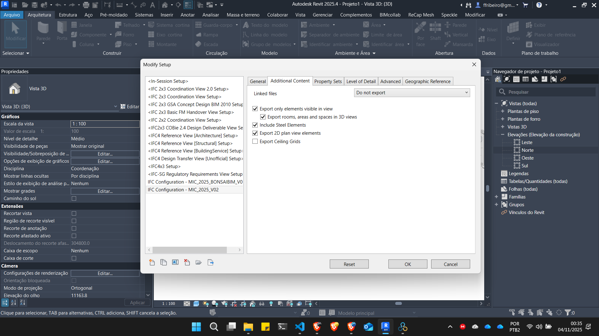
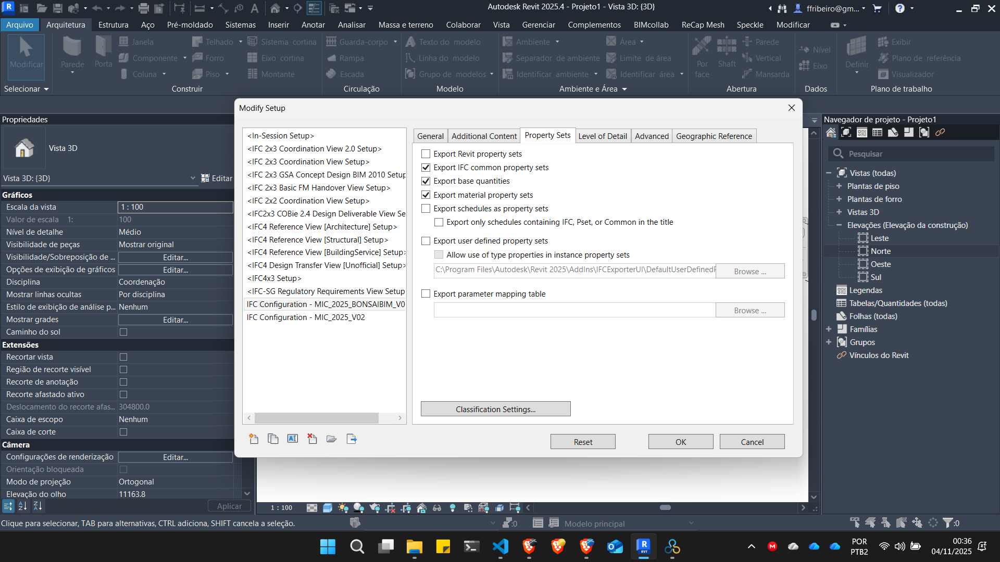
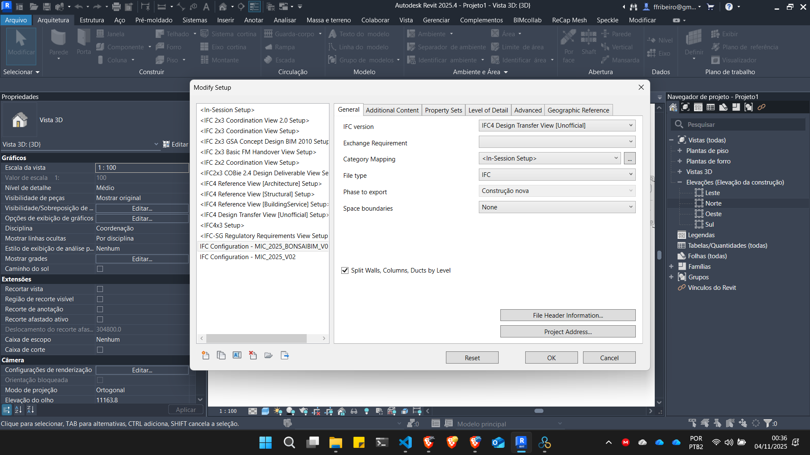
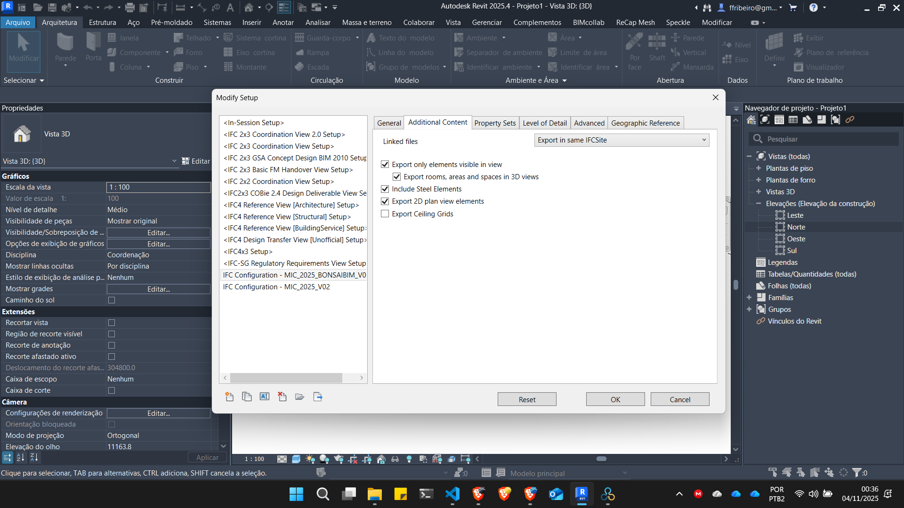

# Configurações básicas do exportador IFC

## Configurando Exportador IFC no Revit

### Baixando configurações de exportação

[configuração 01]("IFC Configuration_MIC_2026_V00.json") -> exportar os arquivos individualmente

[ginfiguração_02]("IFC Configuration_MIC_2026_todos_V00.json") -> exportar todos os arquivos a partir do modelo federado como arquivos IFC separados

[configuração 02](<IFC Configuration - MIC_2025_BONSAIBIM_V01.json>) -> exportar todos os arquivos a partir do modelo federado como um único arquivo IFC

### Configurações básicas

#### Exportação de arquivos individuais:

Exportar os arquivos individuais utilizando a configuração abaixo:

#### Exportação BlenderBIM:

Exportar o arquivo federado com todos os arquivos linkados utilizando a configuração abaixo

