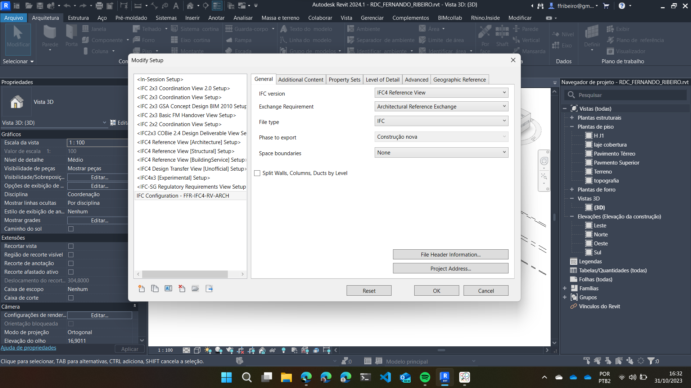
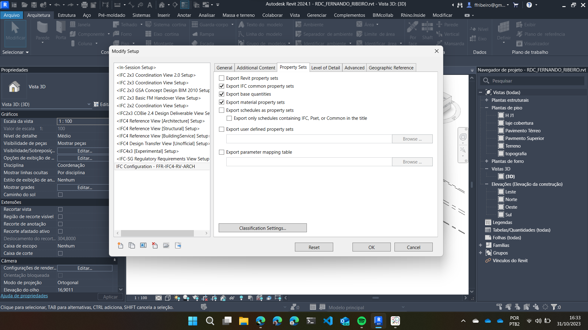
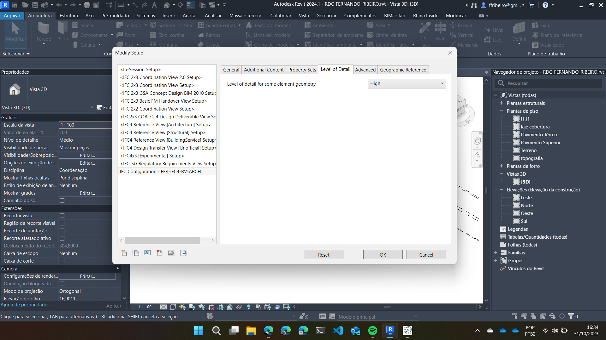
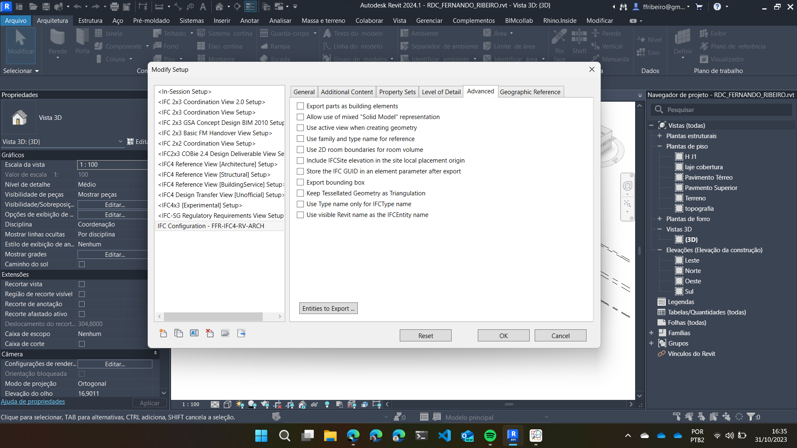

# Configurações básicas do exportador IFC

## Configurando Exportador IFC no Revit

### Baixando configurações de exportação

[IFC Configuration - MIC_2025_V01](<IFC Configuration - MIC_2025_V01.json>)

### Configurações básicas:

