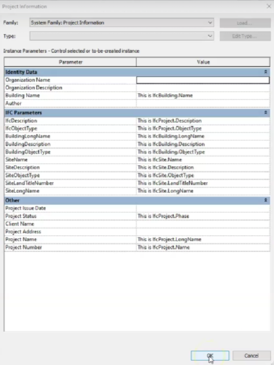

# Dados do projeto, edifício e terreno.

| Revit Project Info (English) | Revit Project Info (Português-BR) | Mapeamento IFC |
| :--- | :--- | :--- |
| Project Number | Número do Projeto | `IfcProject.Name` |
| Project Name | Nome do Projeto | `IfcProject.LongName` |
| Project Status | Status do Projeto | `IfcProject.Phase` |
| Building Name | Nome do Edifício | `IfcBuilding.Name` |
| Site Name | Nome do Local | `IfcSite.Name` (via parâmetro compartilhado *SiteName*) |
| *IfcDescription* (Shared) | *IfcDescrição* (Compartilhado) | `IfcProject.Description` |
| *IfcObjectType* (Shared) | *IfcTipoObjeto* (Compartilhado) | `IfcProject.ObjectType` |
| *BuildingDescription* (Shared) | *DescriçãoEdifício* (Compartilhado) | `IfcBuilding.Description` |
| *SiteDescription* (Shared) | *DescriçãoLocal* (Compartilhado) | `IfcSite.Description` |

