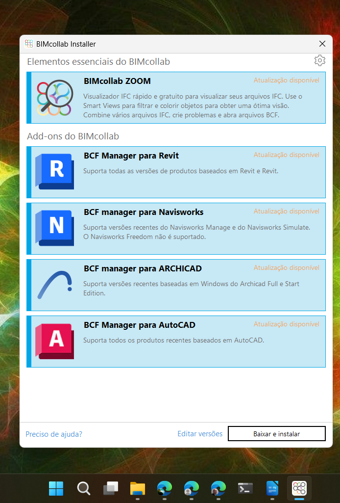

# instalação do BIMCollab

A maneira mais prática de instalar o Bimcollab é através do instalador (apenas Windows), que pode ser baixado no link abaixo:

[https://helpcenter.bimcollab.com/portal/en/kb/articles/downloads](https://helpcenter.bimcollab.com/portal/en/kb/articles/downloads)

O link direto para baixar o instalador para Windows é:

[https://bimcollab.com/download/BIMcollabInstaller](https://bimcollab.com/download/BIMcollabInstaller)

Após a instalação, o instalador mostrará uma tela com links para instalar:

 * O BimCollab Zoom
 * E os plugins para os softwares escolhidos.

Instale os plugins para os softwares:

  * Revit,
  * Navisworks,
  * Autocad,
  * Archicad.

Caso não seja possível instalar pelo instalador, os programas tem que ser instalados manualmente, um a um, pela página de downloads do BimCollab:

[https://helpcenter.bimcollab.com/portal/en/kb/articles/downloads#BIMcollab_ZOOM](https://helpcenter.bimcollab.com/portal/en/kb/articles/downloads#BIMcollab_ZOOM)

## Criando uma conta do BimCollab

Acesse o link para criar uma conta:

[https://my.bimcollab.com/createUserAccount](https://my.bimcollab.com/createUserAccount)

---

## script de transformação de caminhos relativos no arquivo BCP

[link](https://github.com/255ribeiro/bcp_converter_app)