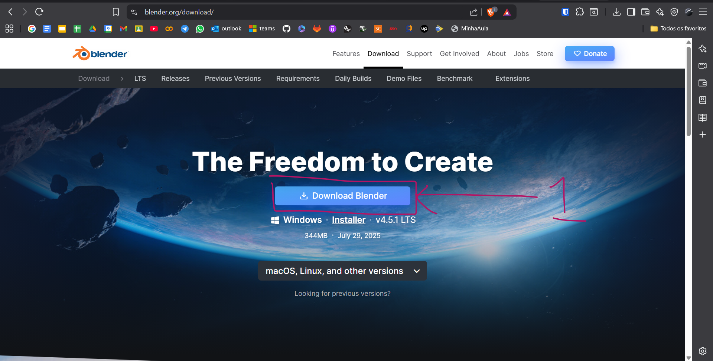
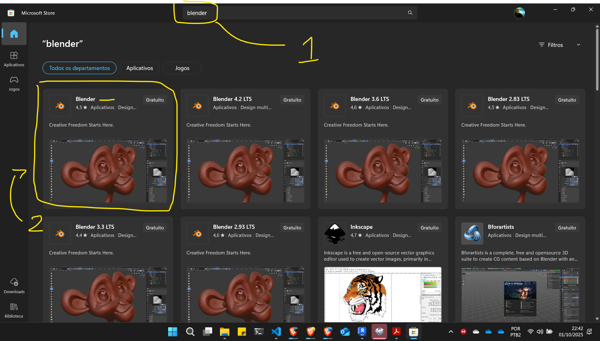
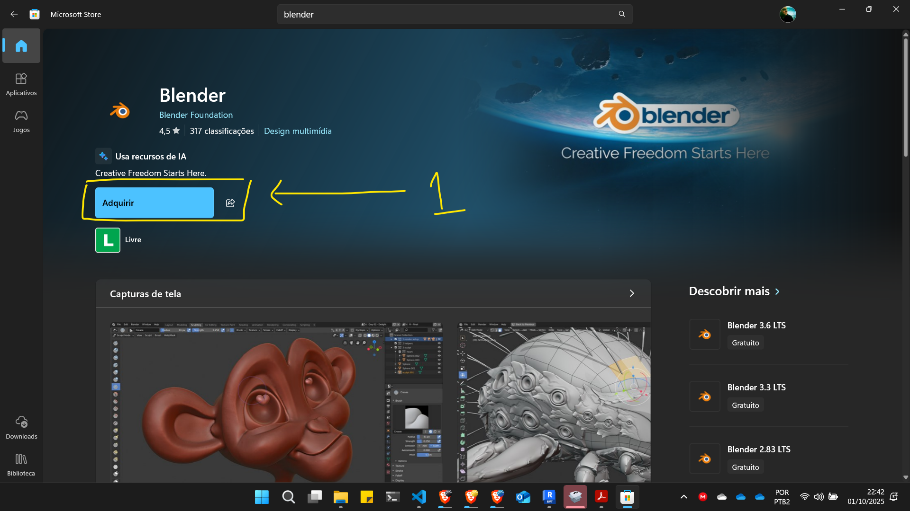
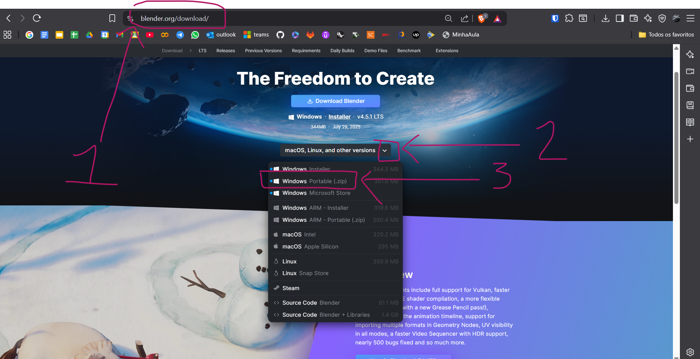
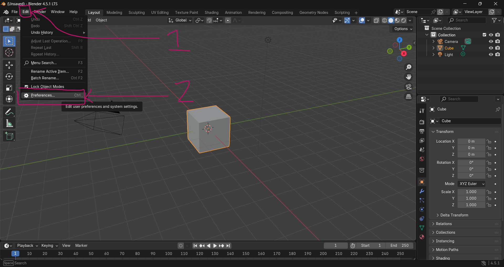
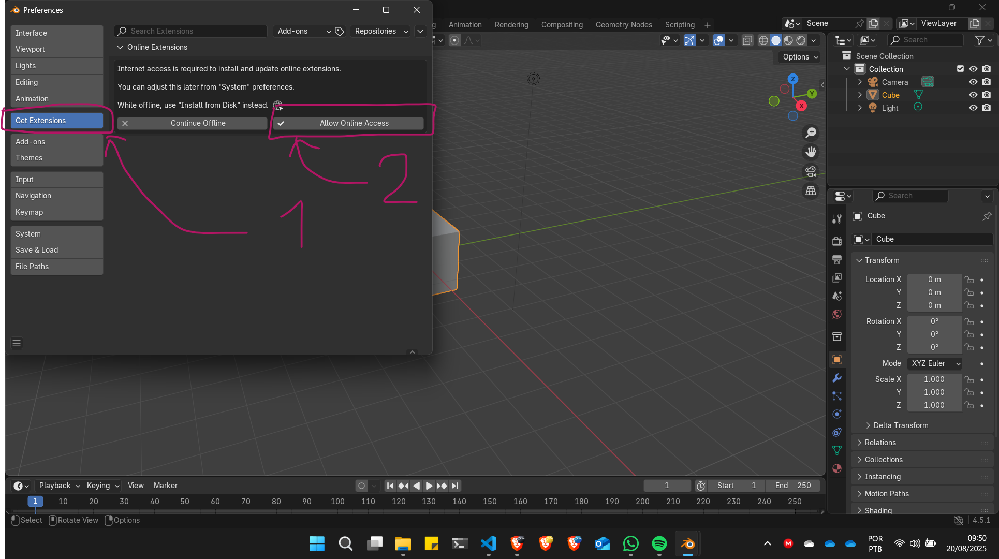
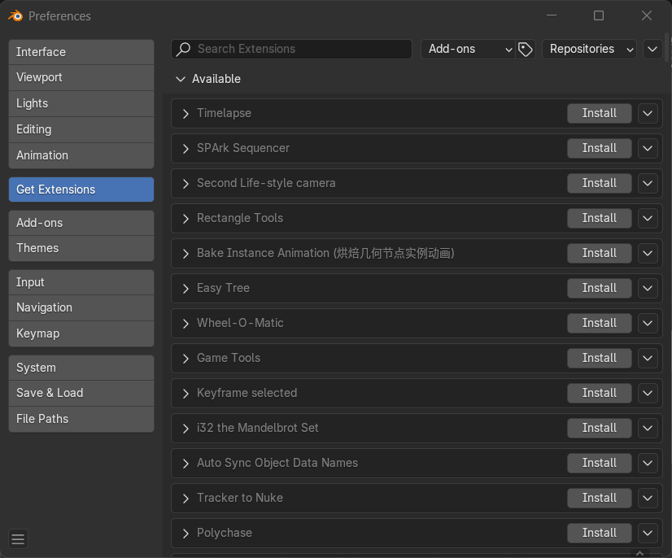
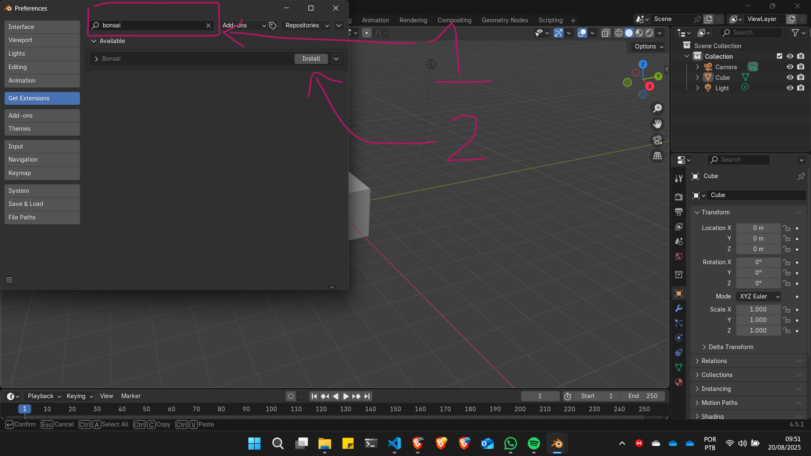
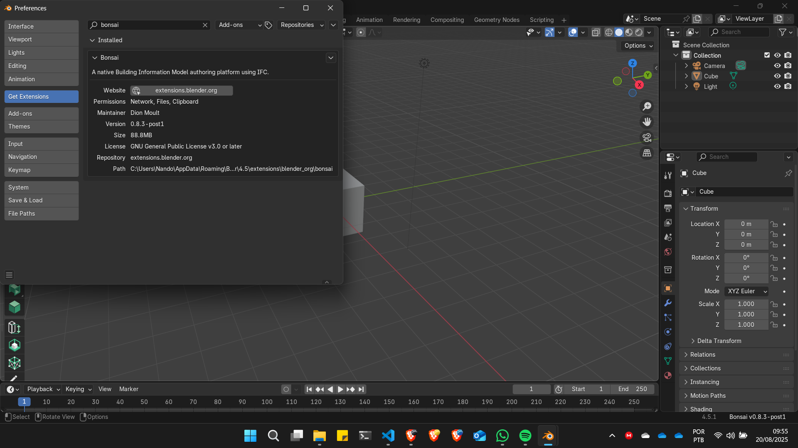

# Instalação do Bonsai BIM (antigo Blender BIM)

O processo de instalação é simples e divide-se em duas partes:

1. Primeiro instala-se o Blender
2. Em seguida instala-se o BlenderBIM

A seguir mostramos 3 alternativas para instalar o Blender e 1 de como instalar o BlenderBIM.

## Instale o Blender

Existem alguns métodos para instalar o Blender.

### Método 1 - baxado o instalador

No site do [Blender](https://www.blender.org), na página de [downloads](https://www.blender.org/download/) e baixe o instalador.



Execute o instalador e siga as instruções.

### Método 2 - Pela loja de aplicativos do seu sistema operacional

Abra a loja de aplicativos e digite Blender na barra de consulta



Na loja de aplicações do Windows várias versões do Blender vão aparecer. A última versão do programa geralmente é a que **não** tem nenhum número de versão.





### Método 3 - baixando o pacote portátil do Blender

Caso não tenha permissão para instalações de programas na sua máquina, clique na seta de dropdown para acessar outas versões do Blender e procure a versão portátil. e procure a versão potable para o seu sistema operacional.

Aguarde o download terminar, descompacte o arquivo baixado e procure o executável blender.exe e rode. Por esse método, é possível rodar o Blender **até** em um pendrive.



## Instalando o Bonsai BIM

Existem algumas maneiras de instalar o Bonsai BIM. A mais simples é pela api de extensões do Blender.

### Método 01 - Instalando pela api de extensões do Blender

Abra o Blender e abra a janela de preferências. No menu ```Edit``` escolha a opção ```Preferences```.



Se é a primeira vez se instala um Addon do Blender nesta máquina, é preciso habilitar o acesso à API online de extensões do Blender. Na coluna à esquerda da janela de preferências, clique no botão ```Get Extensions```, em seguida clique no botão ```Allow Online Access```.




!!! attention "Atenção!"
    A rede na qual o computador está conectado deve ter permissão para acessar o serviço [https://extensions.blender.org/](https://extensions.blender.org/) e todos os seus subdomínios para proceder a instalação do Addon.

O processo de habilitação e acesso às extensões disponíveis online leva alguns segundos. Quando bem sucedida, uma lista de extensões disponíveis ira aparecer na janela ```Get Extensions```.



!!! Error "Em caso de erro:"

    1. Verifique a sua conexão com a internet.
    2. Na janela ```Get Extensions```, clique no botão dropdown na parte superior direita da janela e escolha a opção ```Refresh Remote```.

    obs: pode ser necessário reiniciar o Blender para que o processo funcione.

    

Com o acesso online habilitado e funcionando, na caixa de pesquisa digite ```Bonsai```. Em seguida o Addon Bonsai vai aparecer na lista de Addons disponíveis para instalação. Clique no botão instalar ao lado do nome do Addon, conforme figura abaixo.



Por ser um Addon robusto, o processo pode demorar alguns minutos. Ao final deste processo o Addon deve estar corretamente instalado no Blender.




